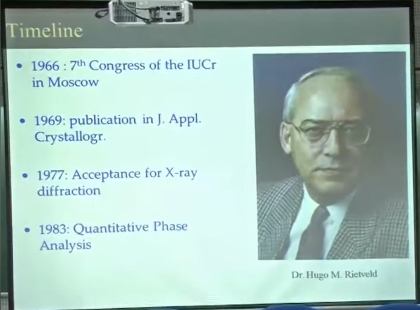
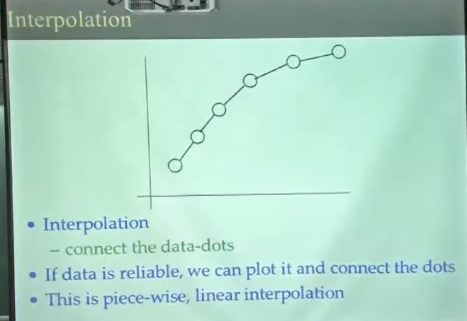
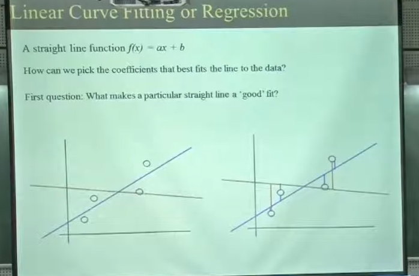
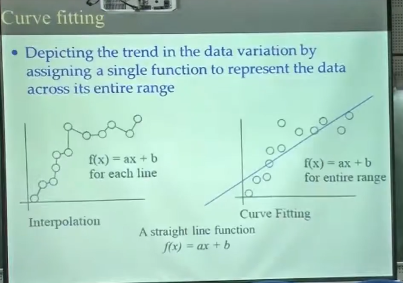
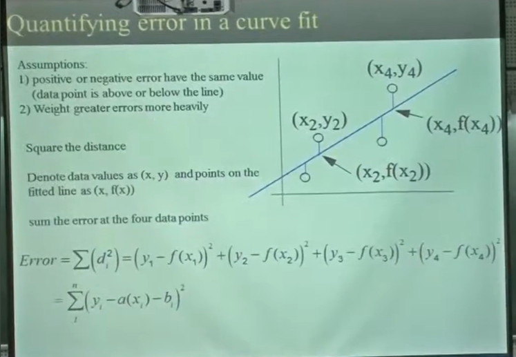
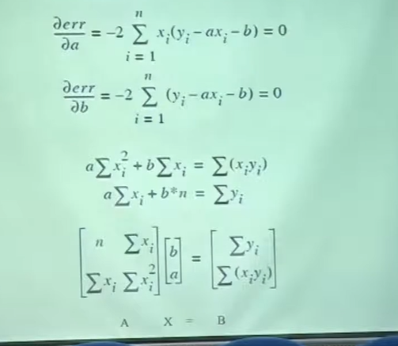
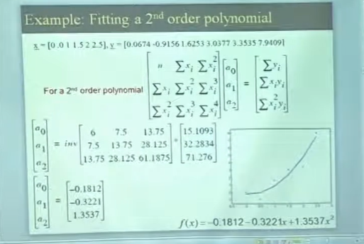
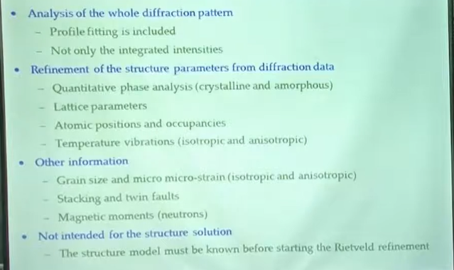

# A Brief Introduction to Rietveld Analysis of XRD Patterns

Video Link - https://www.youtube.com/watch?v=Y808itzb5hw&list=PLZO_dTWSnBCqITbd88ymG7pCol0GGdIvI&index=14

* **References**  
  * R.A Young, The Rietveld Method
  * Georg Will, Powder Diffraction. The Rietveld Method and the Two state method to determine and refine crystal structures from powder Diffraction Data


```txt
Many students do powder diffraction and this can be used to analyze the
powder diffraction data specially in terms of profile fitting, strain
calculations, structure distortions, structure refinement. 
So it is is a fantastic technique. 
But what I am going to do is it is basically a profile fitting technique, its data fitting technique. 
You have to have x-ray data. 

So first of all you have to have a data.
And you need to know something about the sample. 
You need to have some good starting guessing guesses.

```

Rietveld requires initially to have a good guess. If you have the polynomial you cannot start with a straight line.  

Dr. Hugo M. Rietveld -  Dedicated his life in Refinement and didn’t make money out it. Developed program and gave the things for free. He developed Mathematical code and gave it for free.  
So in 1983 it was called Rietveld refinement method instead of powder diffraction method

```txt
If the data looks like second order polynomial and you start fitting a
straight line, obviously you will get a bad fit. So Rietveld requires
you to have some smart guesses, which means you have x-ray data
you need to. When you fitted with a given structure, you need to
have a good guess.
Which means if the structure is FCC.
With different space groups you need to be close to FCC and then
vary the space groups. 
You cannot start with the BCC lattice and
choose different space groups, so guessing.
```



## Difficulties with Powder Diffraction

* Systematic overlapping of diffraction peaks due to symmetry conditions, for example in cubic space groups
* Accidental overlapping because of limited
experimental resolution
* Considerable background difficult to define with accuracy
* Non-random distribution of the crystallites in the specimen, generally known as preferred orientation.

> To overcome some of above difficulties Rietveld developed some methods


## What is Rietveld analysis?

* The Rietveld method refines user-selected parameters to minimize the difference between an experimental pattern (observed data) and a model based on the hypothesized crystal structure and instrumental parameters (calculated pattern)

This is where intelligence guess in the beginning is very important  
A good fit doesn’t mean the answer is right.

* **Full profile fitting**
* **Using crystallographic constraints**
  * Lattice parameters and space group to constrain peak positions
  * Crystal structure to constrain peak intensities

## Least Squares Method

* Curve Fitting

How many of you are aware?  
Let me briefly introduce it to you  







```txt
Let's say you have these data points OK 45 data points, maybe 10 data points. You
draw two lines.
This is blue, blue line and red line. How do you know which one is a good fit? 
Visually it looks as if the blue line is good, but why not red line? 
Do you? Can we develop a quantified method to tell that which fit is good and which fit is not good? 
And this is the purpose of least square fit? What it does is basically is...

It measures the difference between the observed value and the calculated value to a function and square it and takes the sum of all the data points in that
fashion and then sees that for which this error is minimum. 
This is basically the least square fitting. 
```



* The "best" line has minimum error between line and data points
* This is called the **least squares approach**, since we minimize the square of the error

> In above our function is F(x) = ax + b



## Example - Fitting a 2nd order polynomial



## What Rietveld can do?



