# Introduction to x-ray diffraction by Dr Rajesh Prasad, IIT Delhi

## Video Link

Link - https://www.youtube.com/watch?v=Z5aCuGxUPpI

```txt
The experimental technique which establishes crystallography is X-ray diffraction. 
Infact for such a successful experimental technique for crystallography , 
the crystallography was given the adjective X-ray.
Of course there are other diffraction - neutron diffraction, electron diffraction 
and so on but the basic technique for crystallography is X-ray diffraction
```

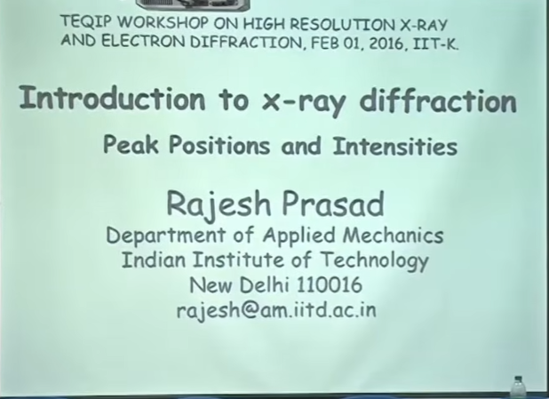

> The history is more interesting. Let us look into some content

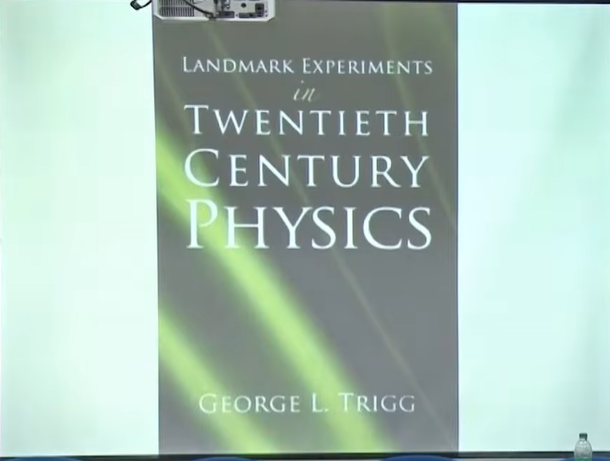

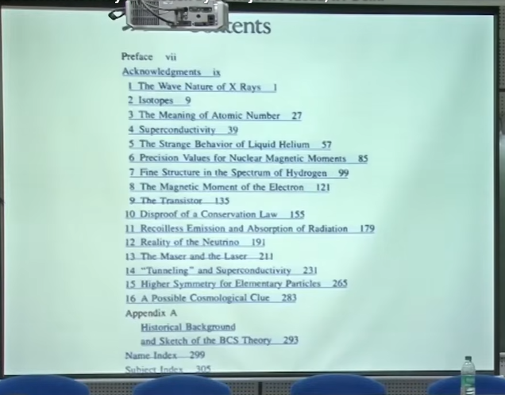

> Laue's experiment was considered one of the greatest experiment of physics.

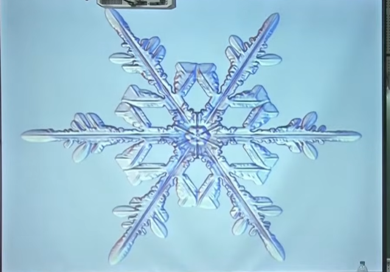

> Look above image. Snowflake, nice 6 fold symmetry, made by nature. So this intrigued people and that was the beginning of crystallography. Why natural crystals. Why snowflake falling from heaven having such nice regular external shape. And this was a very fundamental question of science.

Question 1- Why Crystal have regular external shapes?

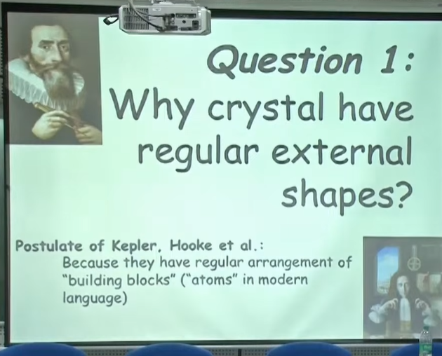

> Kepler not only studied astronomy but also studied structure of crystal.  

> All metallurgists in the morning should show Agarbatti to Robert Hook  
> Micrographia book. His book micrographia was the origin of microscopical study of materials.  
> They started guessing.  
> Atom were not even fashionable words those days, but they started guessing. But there must be something inside

> The tool came much later

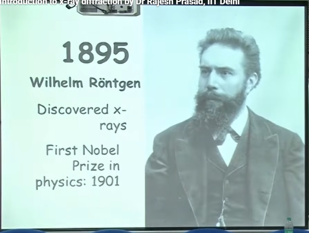

> He got the first nobel prize in Physics 1901

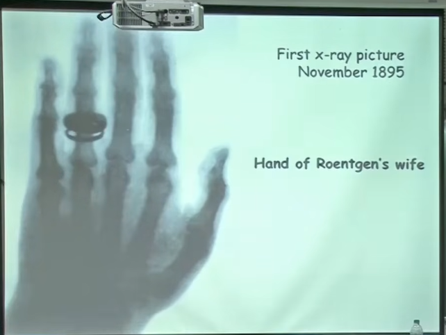

**Question 2 - Are X-rays waves or particles **
X stands for the unknown

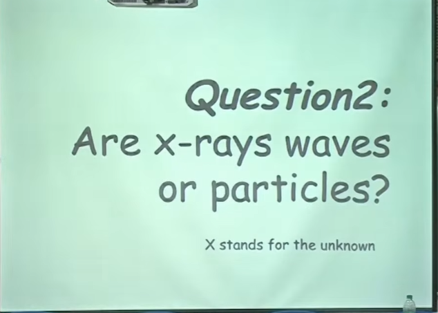

It was given the name X because people did not know what it is.
In our algebra unknown is X.

> Then came this, what is ranked as one of the greatest experiment of 20th century.

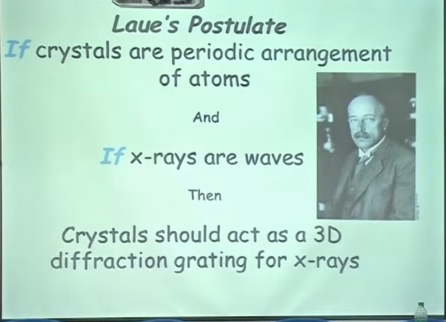

> He used 2 If's  
> Diffraction grating for light was a well established thing.  
> Till x-ray came, nobody thought that copper is a crystal or something. well there was speculations but it was not established fact. Crystal meant something like snowflake or other naturally grown crystal gemstones and so on which has nice external shape.

> And only way to check this will be experiment. Nature can be kind or nature can be unkind. Nature was very very kind to laue's.
> He did get a diffraction  
> If diffraction was not there then neigher of these questions was answered  
> If diffraction was there both the questions was answered.  
> If you don't have diffraction may be X rays are not wave  
> Or diffraction is not there because crystals are not periodic.  
> Or crystals are periodic but x-rays are not waves  

He was lucky

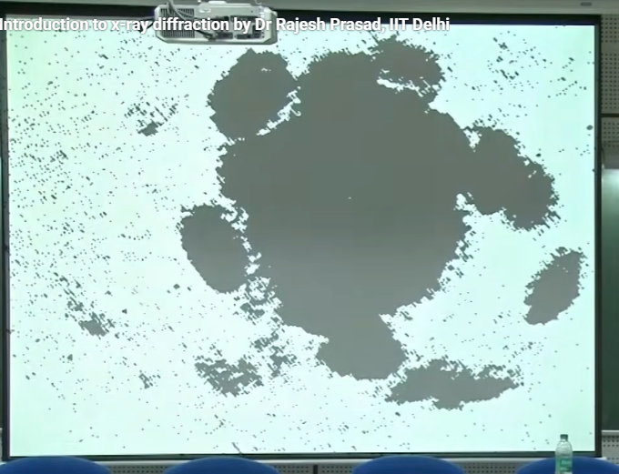

> They could see that apart from the central beam there are beams which are going away from the center and that was the basic difinition of diffraction

With modern techinique

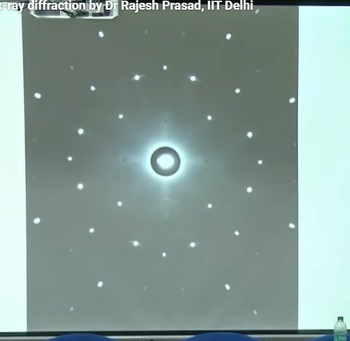

```txt
So the x-ray beam is coming here. And the crystal is somewhere here. 
X-ray is coming along the laser direction.
Then if the crystal was doing nothing and only transmission, 
then only a transmitted block should have been there, transmitted a spot. 
But then after interacting with the crystal, beams are going in 
diffraction and being recorded on a photographic film which is
coinciding with the plane of the screen here
```

> And once after the success of the experiment, 2 great questions were answered in positive 
> that X-rays are waves and crystals are periodic arrangement of atoms. This started the modern crystallography.

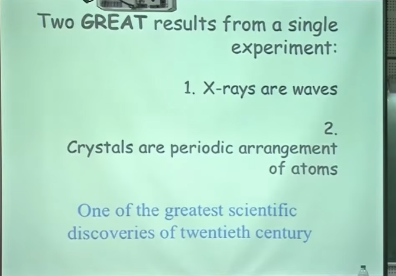

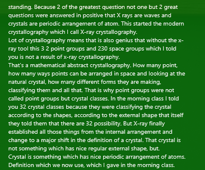

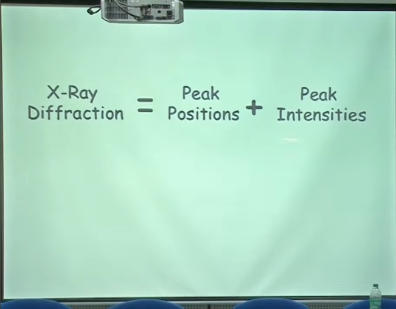

> So essentially, X-ray diffraction analysis is analysis of peak position and peak intensities.  
> The crystal = Lattice + Motif  
> So both equation are in exact correspondence.  
> X-ray peak intensities will tell you what the motifs are and  
> peak positions are governed by lattice.


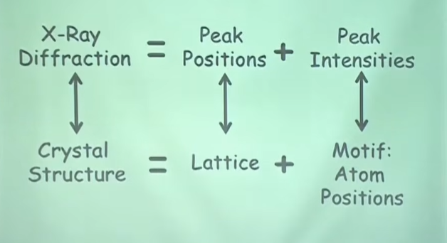

## X-Ray Diffraction

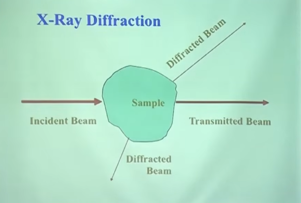

> Now as I told you, there is an incident beam.  
> If nothing was happening and only some absorption of this x-ray and some transmission, then we would have said that there is no diffraction, just transmission.  
> So the very fact that you get a beam in a direction not expected in the direction of the transmitted beam that is what we are calling the diffracted beam.  
> Let us look at the X-ray diffraction in a little bit more detail.  

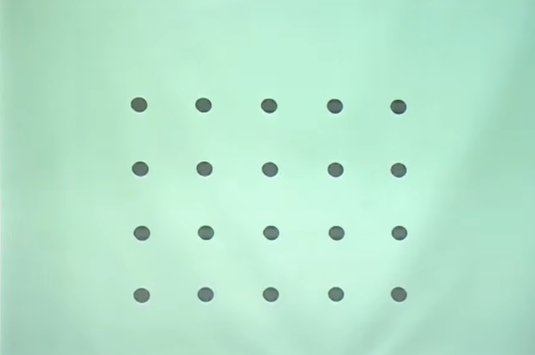

> So you have a periodic set of atoms in the crystal.  
> X-ray is coming and hitting and of course X-ray is not picking and choosing one particular atom, it is hitting all the atoms.  

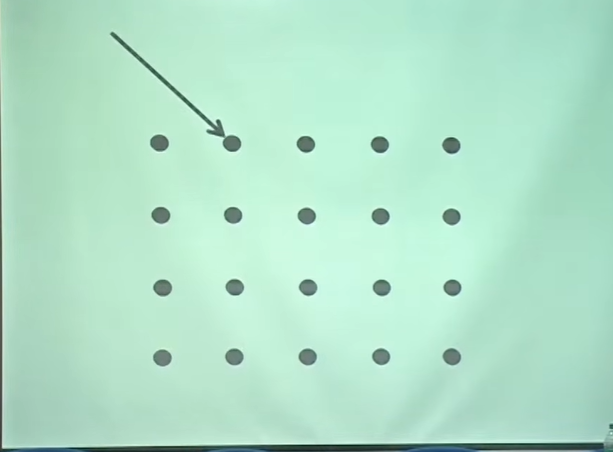

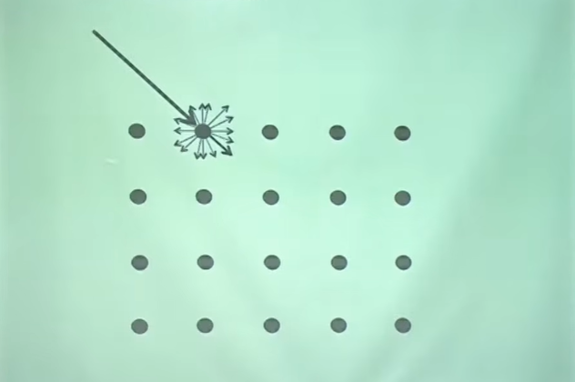

> Let us focus on one atom and as the X-ray is coming, it will interact.  
> The electrons in the atom will interact here with the X-ray and will generate new X-ray beams travelling in all directions  
> So for a single atom or a single electron there is no concept of a diffracted beam.  
> Diffraction is in entire 3D space  
> Similarly all the atoms receive this X-ray  

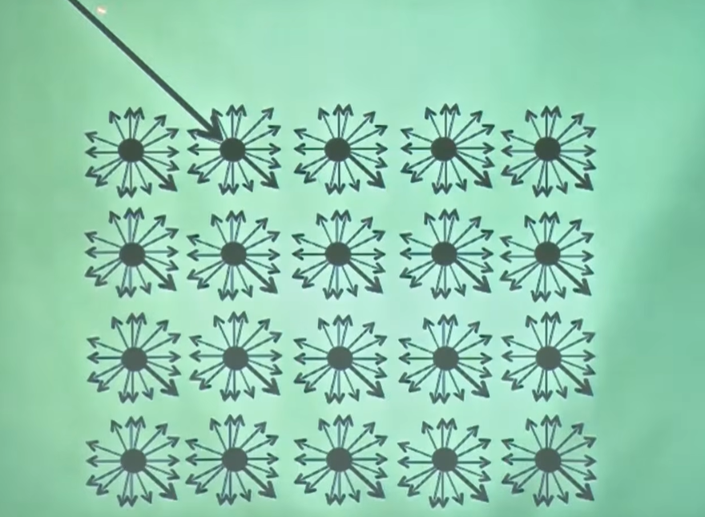

> I have not shown this line for all the atom, but I'm showing this scattered line for all the atoms they are receiving and they are scattering.  

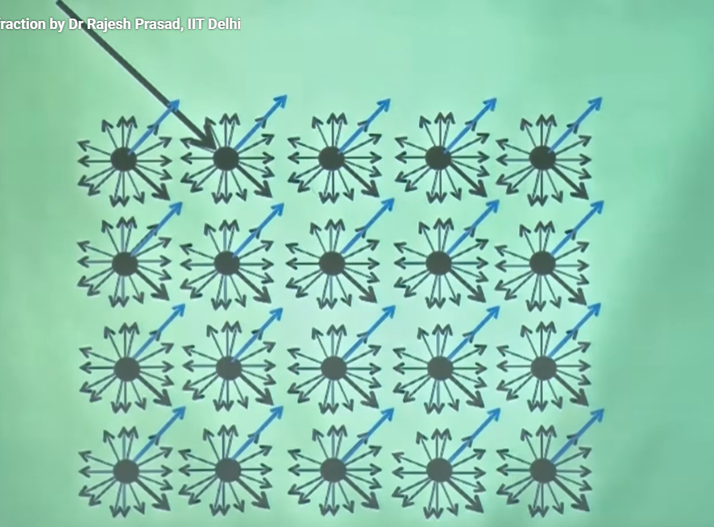

> Then you can pick and choose a certain direction , the blue direction here.  
> And now see whether the X-ray coming from this atom1 and atom2 in the blue direction they are reinforcing or not.  
> So you can apply the path difference and phase difference rule and see whether you get addition or you get cancelation.  
> If you have an addition then you have a strong beam, I mean waves get added up to give you strong beam  
> They could have canceled also. That depends upon the phase difference you know.  
> I mean, they are In-phase they will add  
> If they are out-of-phase they will subtract and so on.  
> If they were all in phase, you will get a strong beam and that is what we will then call the diffracted beam.  

> Now comes the Bragg's genius  

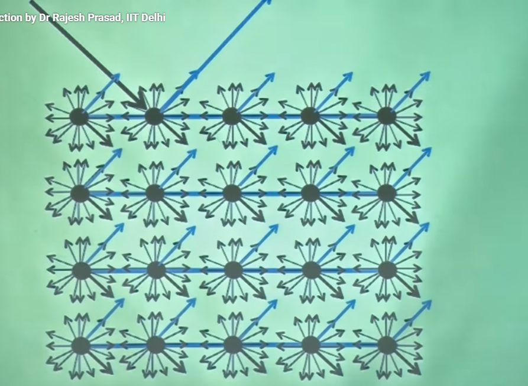

> This much was just a diffraction  
> This much what Laue also saw and got his nobel prize.  
> So Bragg had to do something new to get his Nobel prize.  
> So Bragg introduced this plane.  
> He said for this diffracted beam, I can draw this blue plane and think of it as a reflection.  
> That the black incoming x-ray is reflected into this blue X-ray by these mirror planes.  
> Totally hopothetical and nothing to do with the physics here. Physics has already been done. Physics has been done that you have all these waves and you got a diffracted beam. Analyze it. Laue did that.
> Laue's analysis did not require any introduction of mirror planes.  
> Simply addition of all the waves from all the atoms and you will get , you will predict the correct diffracted beam.  
> But then introducing this mirror plane by the bragg brought in enormous simplicity of the analysis of diffraction pattern  
> And this is why Bragg got nobel prize  

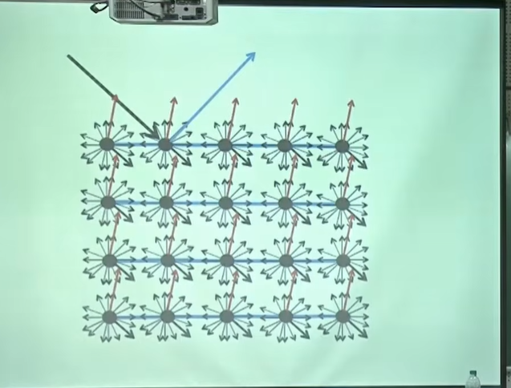

> Of course, the beam may not be adding up in this blue direction.  
> suppose this red, because each atom is giving beams in all the direction and so.  


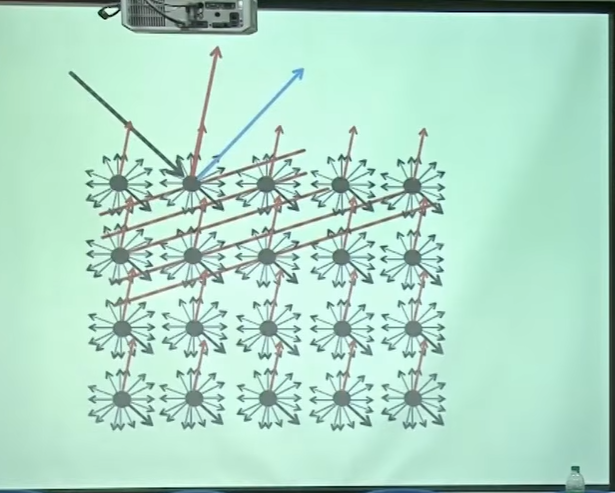

> It may happen that in some other red direction also the beams add up and are in phase  
> But then it is not appearing to be mirror reflected from the blue  
> Don't worry Bragg said.  
> Consider now this. Switch off the blue plane consider red planes from which it will appear to be reflected  
> For this wall, this wass Bragg's genius.  
> This was imaginative gem. which didn't come from a logical deduction or something  
> But by seeing , looking at the problem and coming up with this nice mirror planes.  


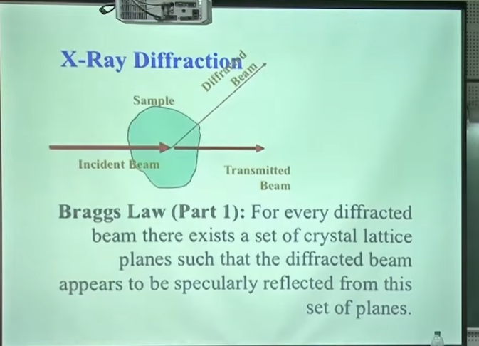

> What Bragg said and what is real Bragg's law?  Ask any student Bragg law is lambda = 2dSin(ɵ)  
> No that is trivial  
> That's not what Nobel Prize got to Bragg  
> Part of the Bragg's law is usually hidden in the textbooks  
> बोलते ही नहीं कि ये ज़्यादा important है ।  
> Specularly reflected means like mirror or mirror like reflected from this plane.   
> This is the real part of the Bragg's law. this is Bragg's genius. This is the Nobel prize of Bragg.  


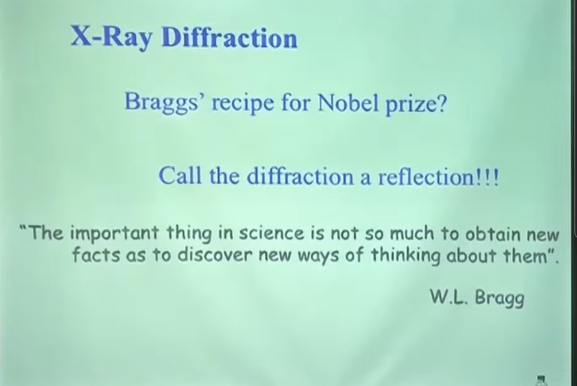

> How did Bragg got Nobel prize, by calling diffraction a reflection  
> नाम बदल तो नोबेल Prize मिल जाएगा ।  
> He didn't discover new  
> He didnot discover X-ray  
> He didn't discover diffraction, Laue did.  
> Bragg got the nobel prize for calling hte diffraction a reflection  
> He thought of diffraction in a new way, looking at it as a reflection from crystal/lattice plane.  
> That changed the whole world  
> This way of looking made it simple to solve the crystal structure  
> That is why Laue although discovered diffraction, did not solve even a single crystalline structure  
> and Bragg started solving the crystal structure one after another. So X-ray diffraction as a tool for crystal structure was established by Bragg.  
> Infact Laue in the very first paper on the diffraction in the analysis of the diffraction pattern, he mixed up and he got the wrong crystal structure.  
> So he couldn't solve because of his complicated way of looking at it.  
> He couldn't solve the crystal structure which actually got him the Nobel prize  
> Of course it was corrected  
> Being wrong is not that bad.

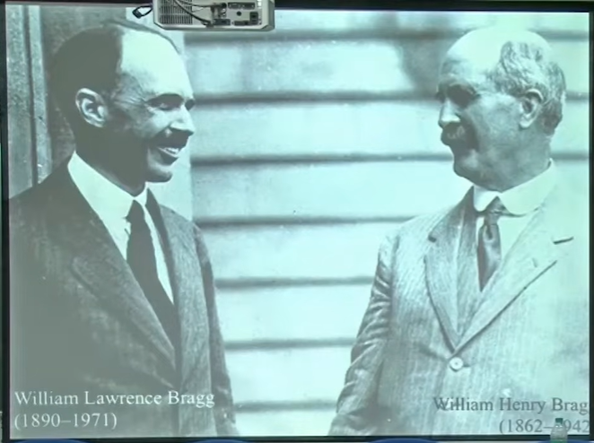

> William Lawrence Bragg and William Henry Bragg. Father and Son team.  
> They shared the noble prize. Although separate nobel prize has been given to father and son but not shared  

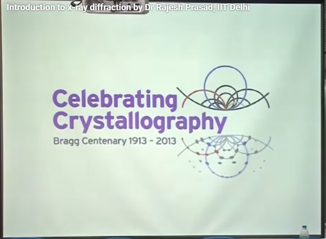

> They declared 2013 celebrating Crystallography year.

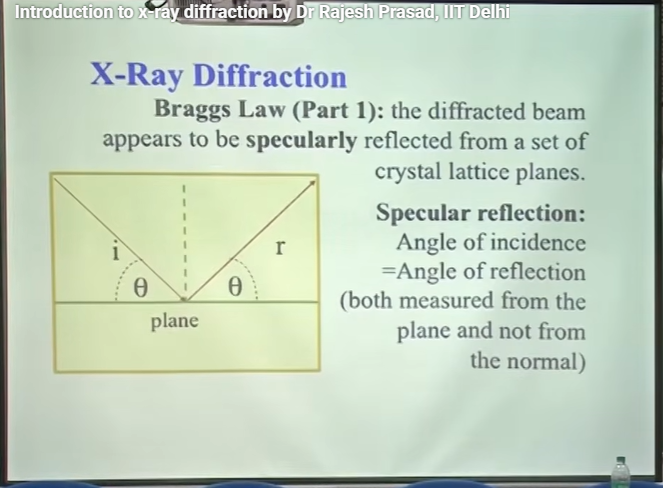

> This was the Braggs first part and the important part that the diffracted beam appears to be specularly reflected from a set of crystal lattice plane.  
> Part2 is very very simple diffraction calculation  


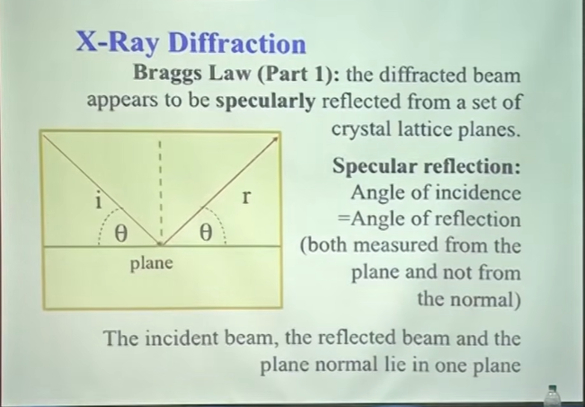

> Once you accept that the diffracted beam is a reflection from the plane, what will be the relation of the wavelength and the theta and the D spacing?  

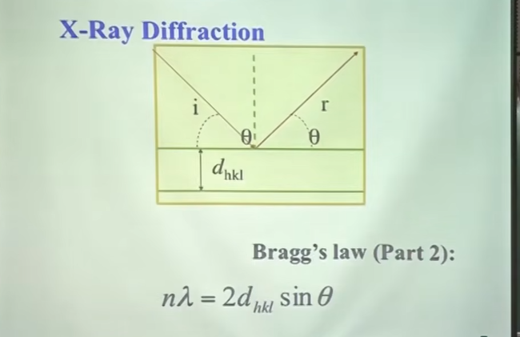

> As I told you, unfortunatley the first part is undervalued  
> Means not emphasized so much as second part, which is given as Bragg's law  
> 2nd part is immediate automatic if you accept the 1st part  
> 1st part is not immediate, not autoamtic, has no derivation. It has imagination  

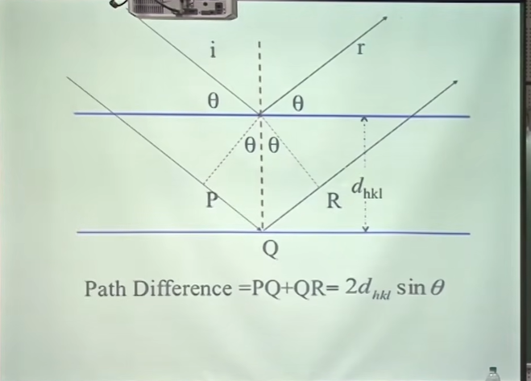

> For constructive interference, integer multiple of wavelength, we know from inteference physics.

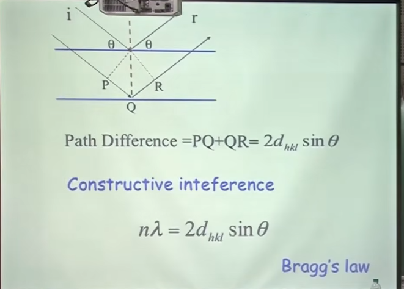

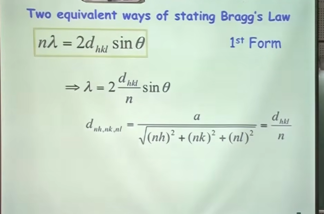

> I am assuming a cubic crystal  

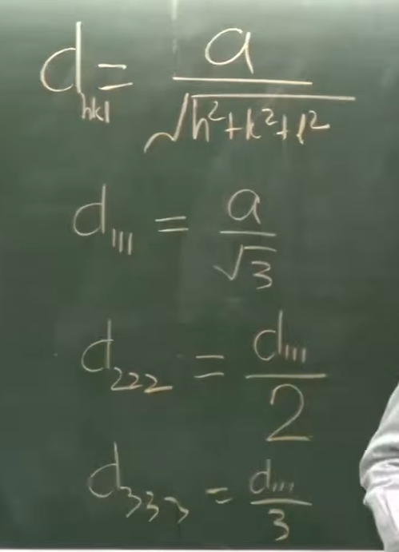

> Using above relationship, one can write as  

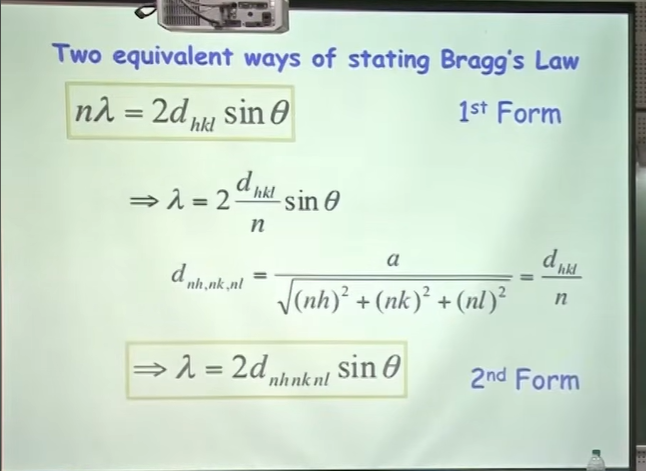

> This disappearnace of N causes enormous problem to beginning students.  
> Above is the final useful form of Bragg's law where N is not there  
> But you should know that N is in a way there but is absorbed in d  

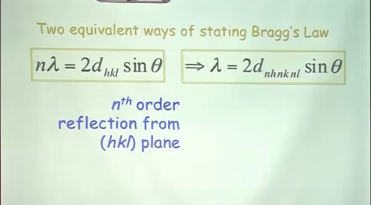

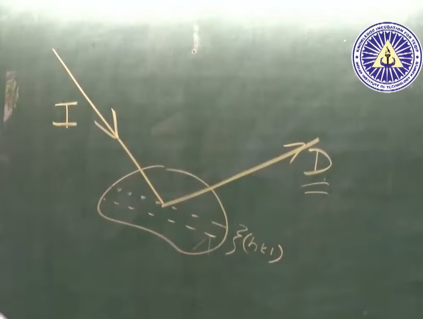

> Essentially what we are saying is that crystal is there, incoming beam and you got a diffracted beam.  
> And we want to name that diffracted beam  
> Bragg showed that you can find a plane from which it is appearing to be reflected. So name it according to the plane from which it is reflected. So I will call this diffracted beam as hkl beam.  
> means it is reflected from the HKL plane, however there is one arbitrariness that


> The path difference between these 2 could have been 1 lambda

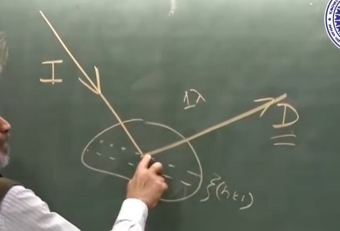

> Then I will call it - the first order diffracted beam

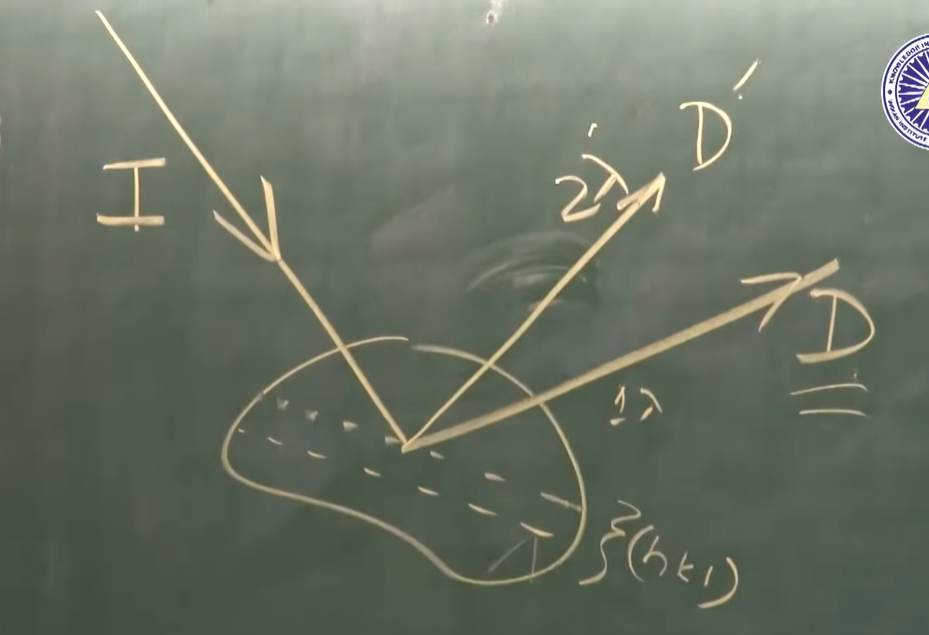

> Some other beam, path difference will be 2 lambda  
> So you have nth order reflection from hkl plane  
> Depending on this N you define the order of the diffraction or order of reflection


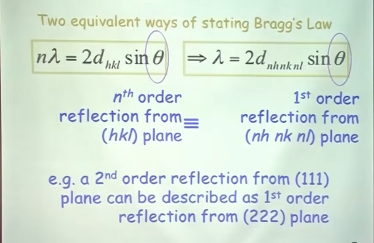

> Here N is always 1, so this is always first order reflection
> So if you have a second order reflection from 111, that will be the first interpretation. Instead of calling that we will say this is the first order from 222  
> So it's just a language, there is no physics involved in this.  
> There is just this algebra, little bit of algebra that you bring this N here and call d-hkl as d-nh-kl-nl  
> And what was appearing to be the Nth order, you call it the first order  
> But can we not decide whether it is the nth order or a first order - No.  
> Because the experimental tool which is available to us is this lambda and this theta.  


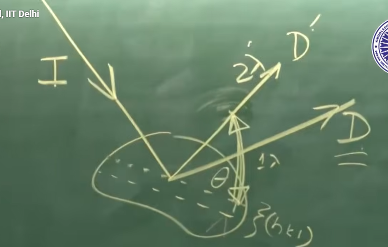

> So we see beam is coming in which direction ? so i know theta  
> And whether I assume nth order reflection from N-hkl plane or first order reflection from nh-kl-nl plane we well get the see theta  
> So this particular beam, the theta beam which is the physical thing can be given either this name or that name.  
> Physicist sometimes choose this and confuse more people in their books  
> But crystallographers you will find those X-ray crystallographers who are actually into solving crystal structure will never try to use N lambda. They will use this form for all reflections listed as first order  


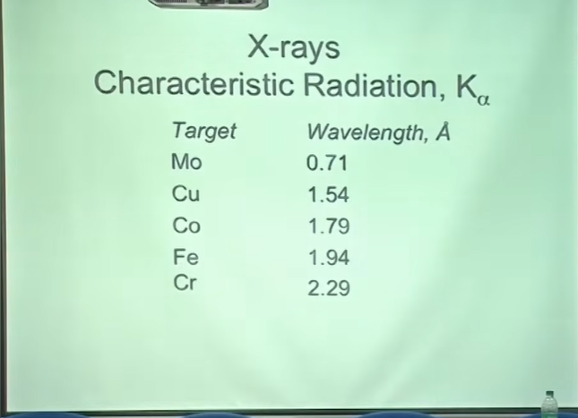

> Now to get the X-ray first you have to generate it for X-ray diffraction  
> The way to generate it is that you impinge high energy electrons on to a taget metal.  
> So when high energy electrons impinge a target metal they give you X-rays of different wavelenght  
> This is what happens in the so called X-ray tube of the part of your experiment  
> So every X-ray diffractometer will come with an X-ray tube generator  
> And in that tube the target will be one of these metals.  
> Copper is quite common, so if copper is there then wavelength which you will get out of it is 1.54 Angstrom.  
> These are called the characteristic wavelength  


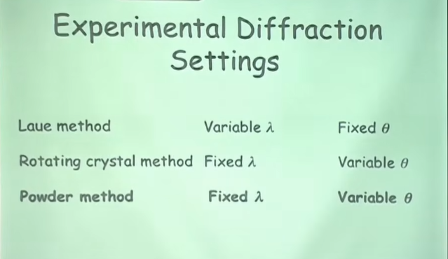

> Now depending on ...  
> See lambda = 2dSin(theta)  
> So in your experiments you can involve either variation of lambda or theta  
> D you can't do anything. D is fixed because that is defined by the crystal which you are studying  
> So experimentalist can play with Lambda, experimentalist can play with theta  
> So based on this different kinds of experimental setups have been defined  


> In the laue method, lambda is variable. So they use white radiation - mixed wavelength not characteristic wavelength.  
> In rotating crystal method, lambda is fixed and theta is variable  
> In powder method, which is most common and which is what I will discuss in more detail in the remaining part of the lecture - has fixed lambda and variable theta  
> But the way they vary theta in the rotating crystal method - they actually rotate the crystal to vary theta  
> In powder method, nothing is rotating, simply because you have a polycrystalline powder. each grain is differently oriented, so that is what giving you a variable theta  

## Powder Method

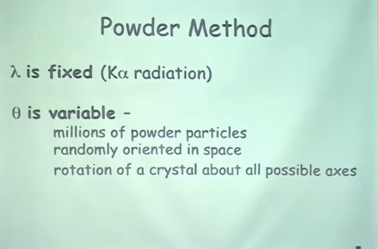

> So here X-ray will come and hit them at different angles so theta becomes variable.  
> In the rotation crystal method there is a fixed axis of rotation  
> There is only one axes about which the crystal is rotated

> Now let's look at little bit of schematic detail of the powder diffractometry  
> So you have a incident beam, you have a sample and you have a transmitted beam  

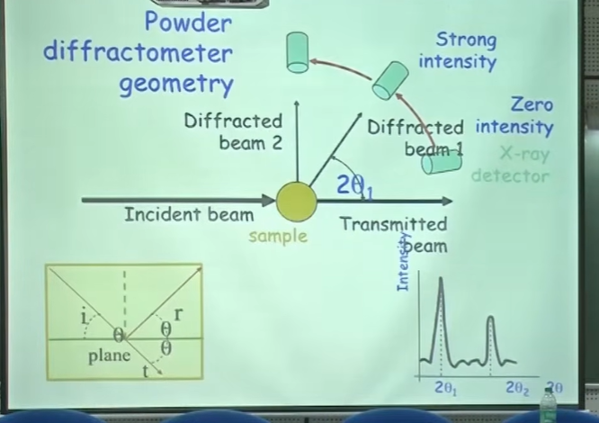

> And you will have one or more diffracted beam. Diffracted beam 1, diffracted beam 2.  
> You have to catch these diffracted beam to get your diffraction pattern  
> To catch that there is an X-ray detector  
> An X-ray detector moves in a circle around the sample.  
> Sample is at the center of the circle and X-ray detector will move.  
> By Bragg's law, you know that the angle between transmitted beam and the diffracted beam is always 2theta  
> This is very simple  
> Sometimes students are not able to answer this question - And why are you plotting intensity against 2theta.  
> You will not see in any other graph that the x variable is multiplied by 2. Makes no sense  

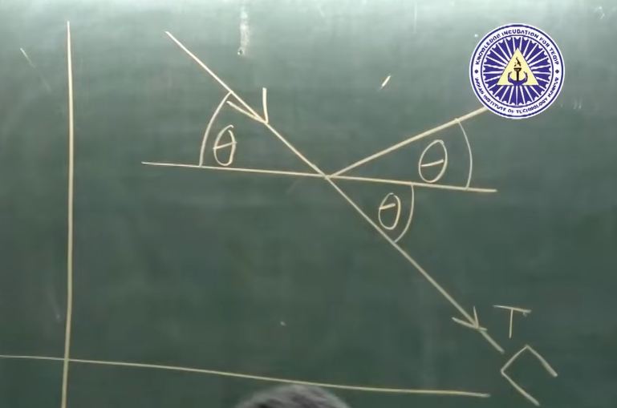

> But in this case it makes sense because  
> According to Bragg's law, since it is a reflection, the incoming theta and outgoing theta is same from the plane  
> But you are not seeing the plane  
> Plane is not there expermimental to see 
> So you cannot measure by any goniometer or something that here is the plane and here is my theta  
> So experimentalist cannot see the plane  
> That is whythis 2theta concept came  
> Experimentalist can see where is the transmitted beam gooing. It is a transmitted beam, he can catch that  
> And he can catch the diffracted beam and then by geometry  
> The angle between transmitted and diffracted beam becomes 2theta  
> That is why you plot intensity as a function of 2theta  
> So as the detector is moving, it is catching the beam  
> How much the detector has moved gives you 2theta  
> And how much intensity it is catching gives you high or peaks  
> so that gives you the diffraction pattern intensity vs 2theta which you get from these diffractometers  

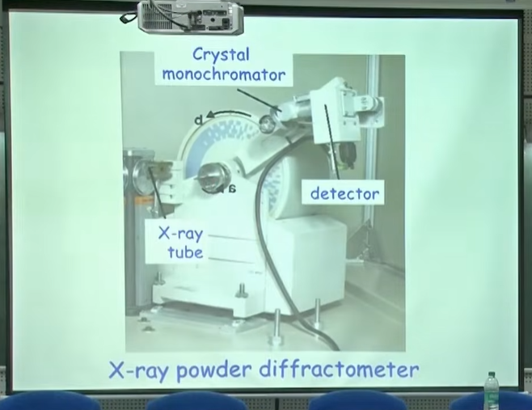

```txt
so that is actual deflectometer 
so this is the circle on which detector is moving
here is the detector here is the sample  
here inside so in the center of this Circle 
this is the X-ray generation tube so there will be metal Target here 
on which the electrons generated here 
somewhere there in the bottom will come up hit it x-ray will be produced 
and will be taken into this defractometer so that incoming defract beam 
will be there and then using the detector at different angles 
you will catch the diffracted beam at different angles we'll get
```


