# Introduction to TEM(Transmission Electron Microscopy)
Link - https://www.youtube.com/watch?v=XrKf7lE-i2I&list=PLZO_dTWSnBCqITbd88ymG7pCol0GGdIvI&index=16

## Outline

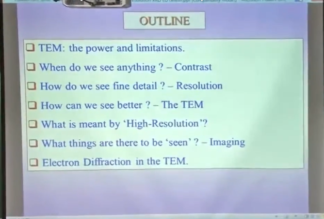

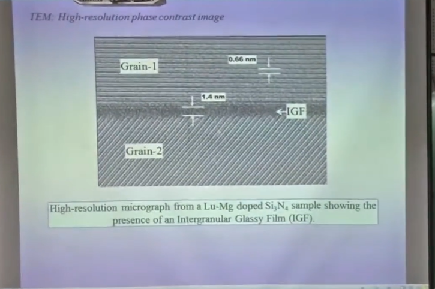

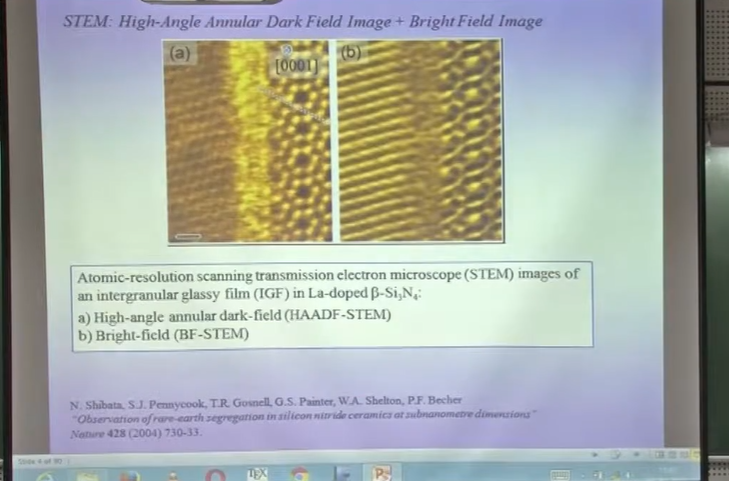

> STEM - Scanning Transmission Electron Microscipe

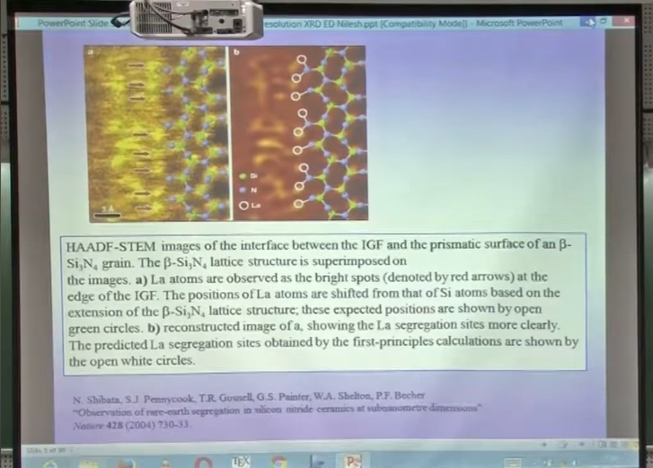

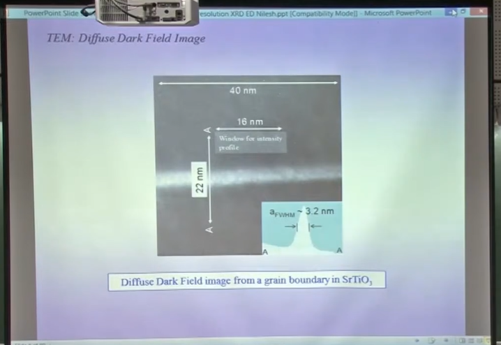

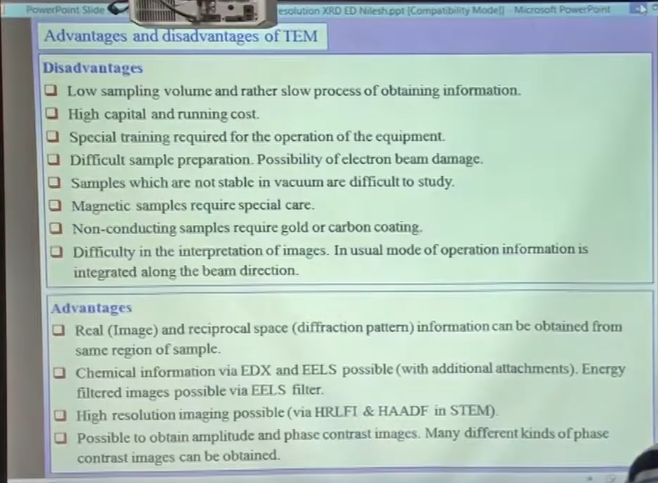

## What should we do before we do TEM on a sample?

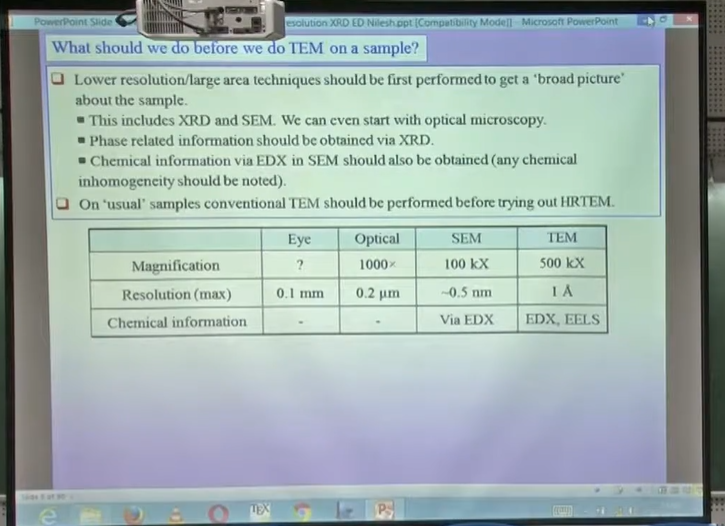

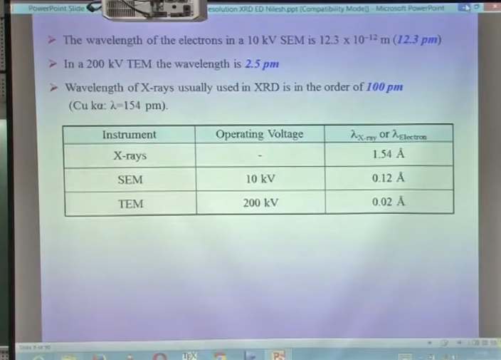

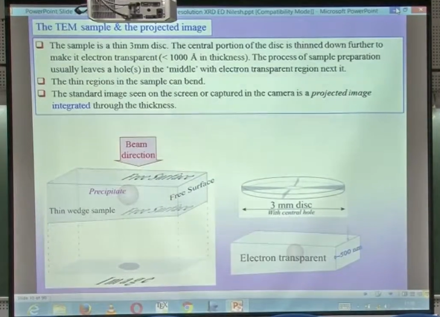

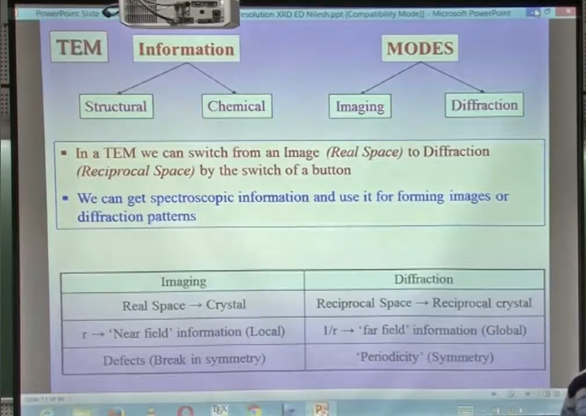

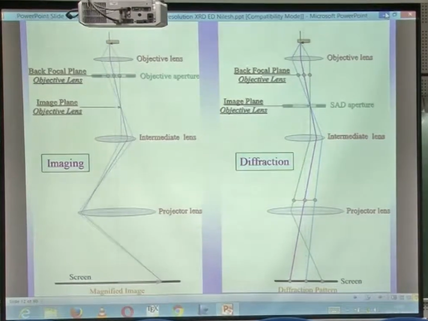

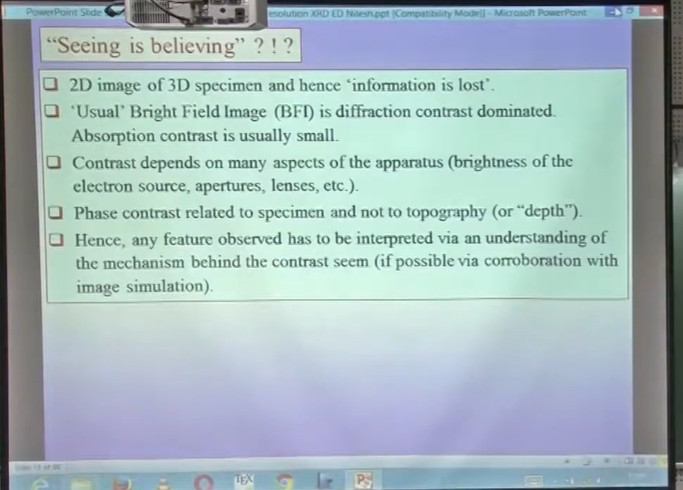

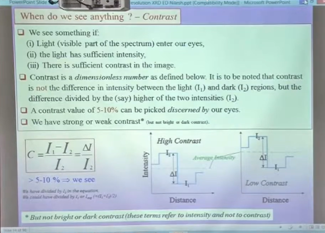

> Contrast is a dimensionless number  

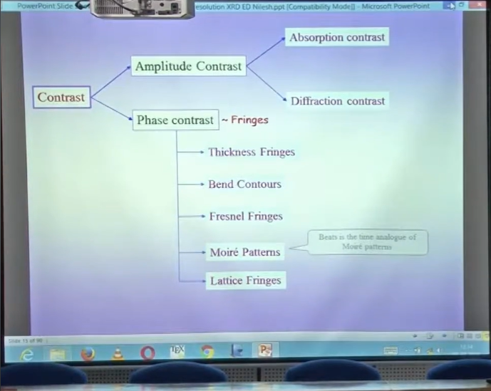

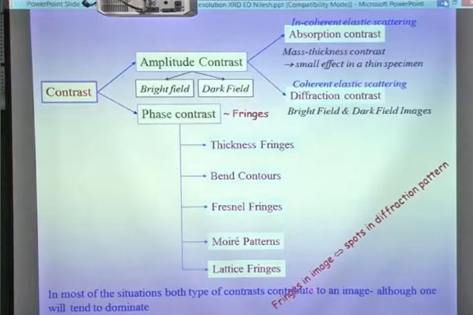

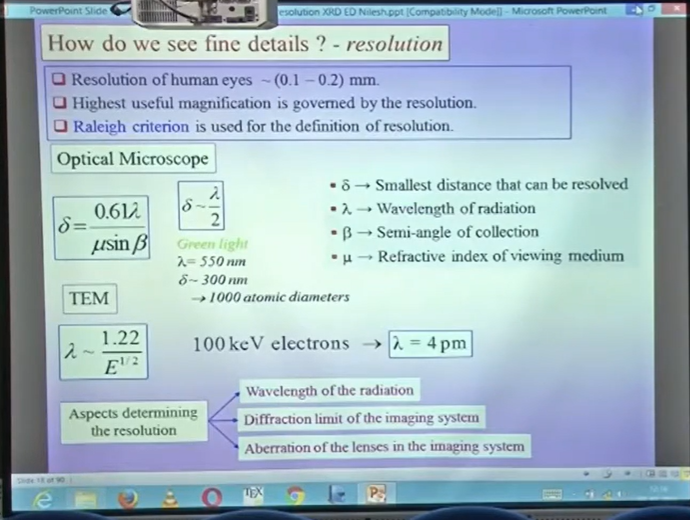