# Rietveld Demo by Ashish K mall, PhD student IIT Kanpur

Link - https://www.youtube.com/watch?v=Ye8A97gzXPc&list=PLZO_dTWSnBCqITbd88ymG7pCol0GGdIvI&index=11

## Rietveld Refinement Technique

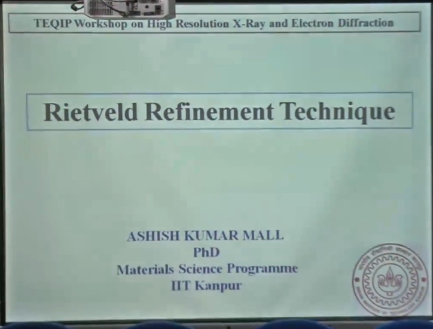

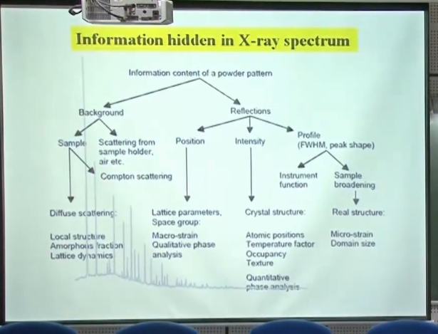

> I will talk about my experience with refinement  
> Suppose you have an X-ray data, A lot of information is behind the X-ray data  
> e.g. background, reflections  
> Most of the times users taking the data from the operator and the operator gives the data with background correction  
> If you are really interested in refinement, do not do the background correction.  
> Take the data as such as you can  
> The background comes out from the sample and also comes out from the scattering from sample holder, air etc  
> And Reflections have Position, Intensity, and Profile  
> Profile have FWHM - Full width Half Maxima, Peak Shape. It may be Gaussian, Lorentzian or mixed shape(it's called Pseudo white)
> Position is related to lattice parameters  
> Intensity is related to Crystal Structure  
> The shape of your peak, you should be aware about from the instrumental broadening also  
> And you should know what is your instrumental broadening also. Take some standard sample like silicon disc or silicon and scan in the overall range 10 to 120 and see and what is your instrumental broadening.  And separate from your data  
> Sample Broadening is the real structure of your sample  

## Limitations of the Experiment  

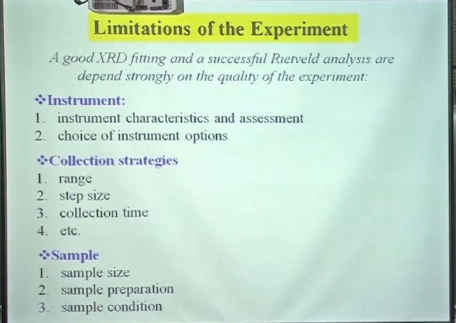

> What is your requirement you should know. Laue's Method , Rotating Crystal or Powder Method.  
> Range - You should take a long range at least 20 to 80 or 10 to 90  
> And higher rnage is also having importance respective to your material  
> Step Size - It is mostly choosen 0.02 to 0.05  
> What is the importance of step size?  
> Suppose your two peaks are very narrow and you took the step size more.  so what will happen?  
> The two peaks will merge and it will give a broad peak  
> The broadening will comes. So you should take as less as possible at least 0.02 to 0.05
> Collection time - What is your speed of collection of your data?  
> What type of Sample you are taking? - You are taking the crystalline or Polycrystalline sample, Amorphoue sample or amorphous with crystalinity  
> Most of the time polycrystalline sample have a flat background  
> But in amorphous or amorphous with crystalinity gives a hum. So do not subtract the background  

## Extracting Information from X-ray data  

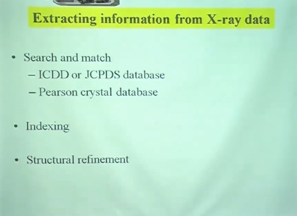

> Suppose you have XRD data in your hand, first you will check if it is in pure phase or not  
> The JCPDS database and ICDD database you can check from these two database.  
> Reference data is nothing but the data which has already been published previously  
> Then if you're sure, you have a pure phase then do the indexing and then you are ready for refinement  

## Rietveld refinement

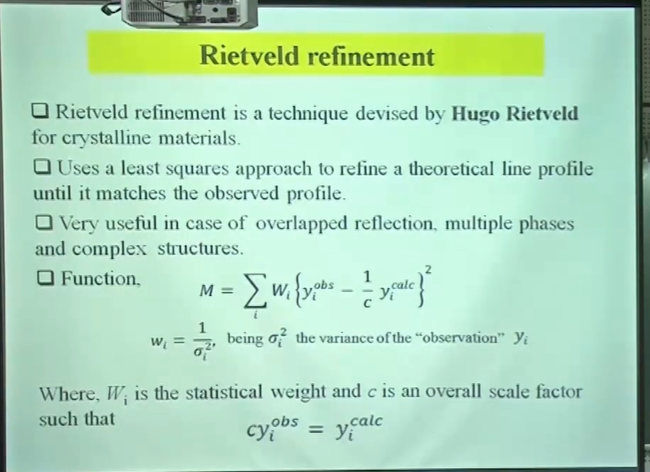

## Useful software

> These are the useful software you can refine you XRD data

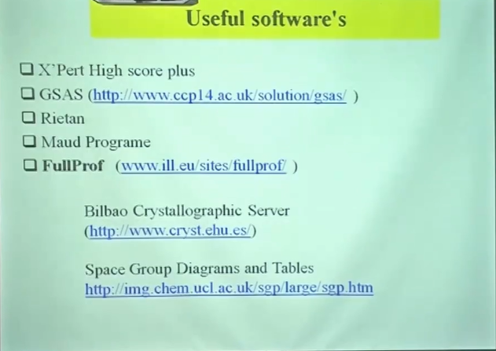

* X'Pert High scrore plus
  * https://www.malvernpanalytical.com/en/products/category/software/x-ray-diffraction-software/highscore-with-plus-option
* GSAS - http://www.ccpl4.ac.uk/solution/gsas/
* Rietan
  * https://ma.issp.u-tokyo.ac.jp/en/app/378
* Maud Programe
  * https://luttero.github.io/maud/
* FullProf - www.ill.eu/sites/fullprof/
  * It came into come in existence because of Juan Rodriguez-Carvajal
  * > Suppose you have an XRD data, you did the indexing and you also know what is the space group because you already have in the database and you also check from this Bilbao Crystallographic server. It's a very good software. It's not a software. It's a database.
  * > And You can see here what is your space group, what is your matrix, what is your Y of position. A lot of position is present  
  * > Suppose the subgroup is changed, so you can change according to previous subgroup. It's having a lot of facilities here. And it's also free.
  * > 
* Bilbao Crystallographic Server
  * http://www.cryst.ehu.es/
* Space Group Diagrams and Tables
  * http://img.chem.ucl.ac.uk/sgp/large/sgp.htm

> PDF2 and PDF4 is the database now in X'Pert High Score
> Now I will tell you about the FullProf  

> This is the FullProf Programme  

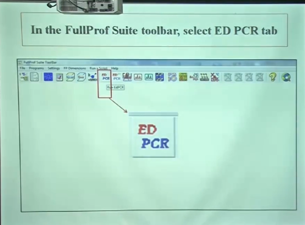

> First click on ED PCR

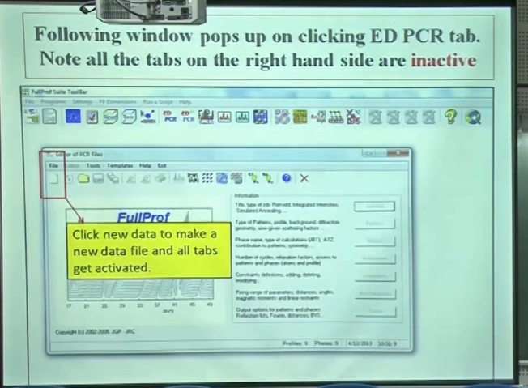

> Click here for new data  

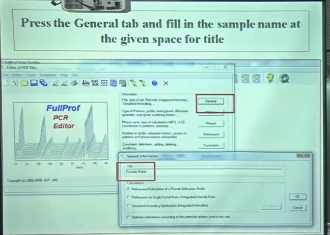

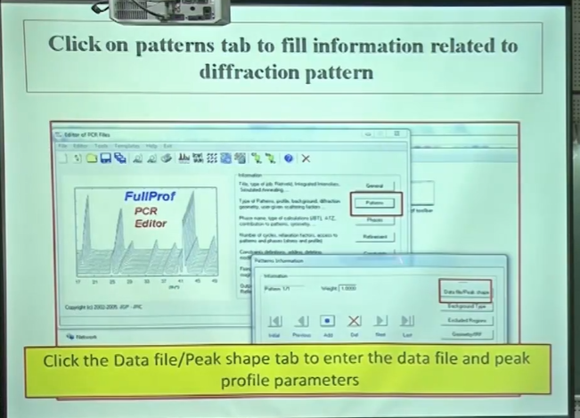

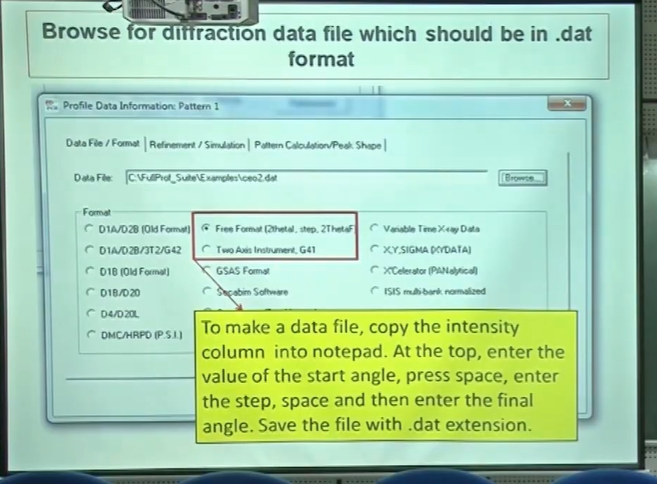

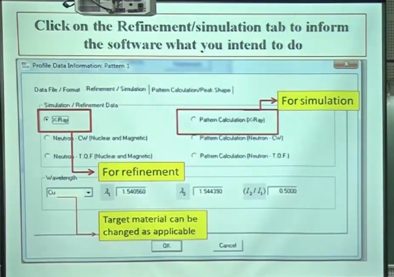

> And then last one is  

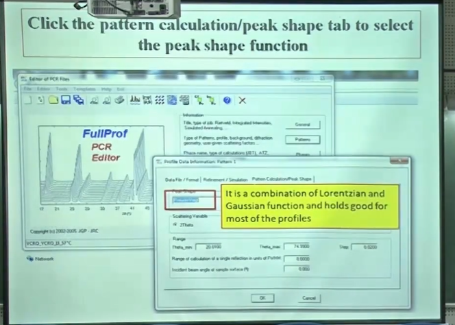

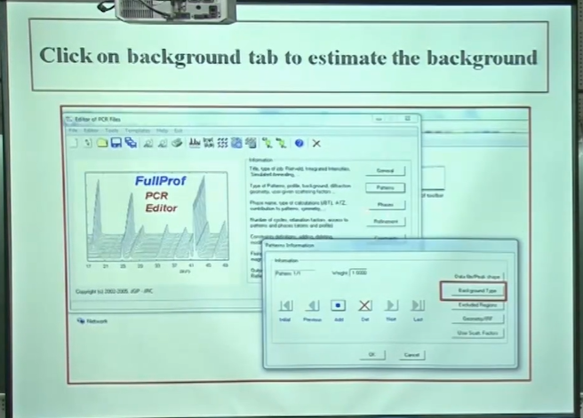

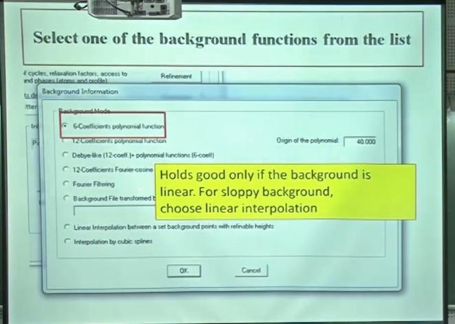

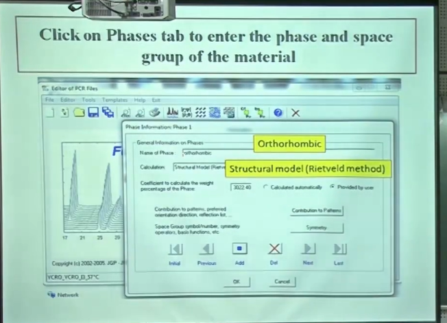

> Some user don't want atomic positions, he just want lattice parameters, so that option is with constant scale factor  
> then the contribution information

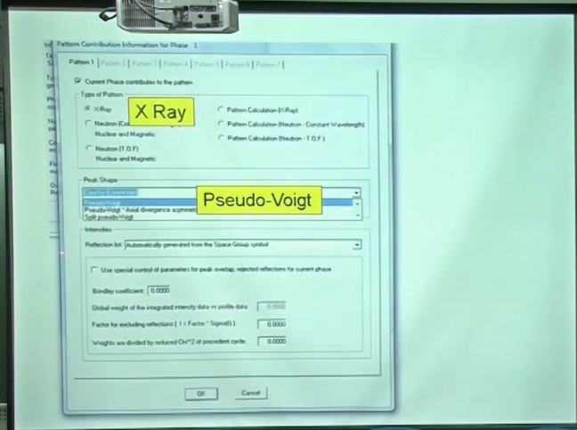

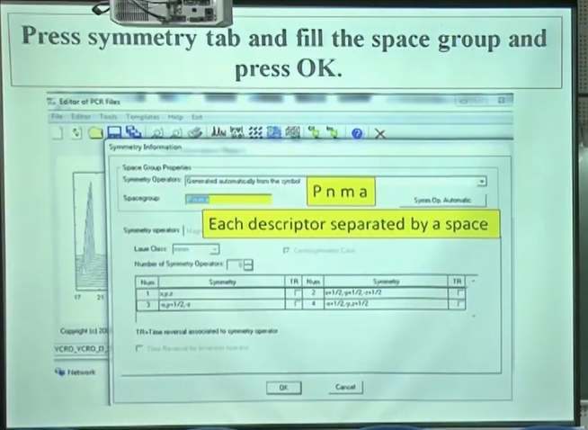

> How will you write the space group

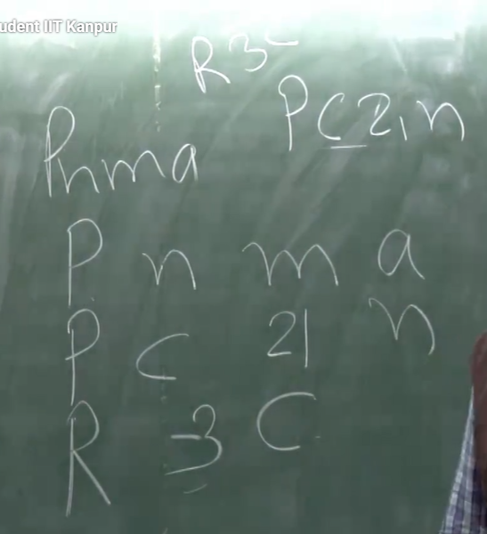

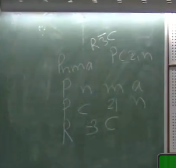

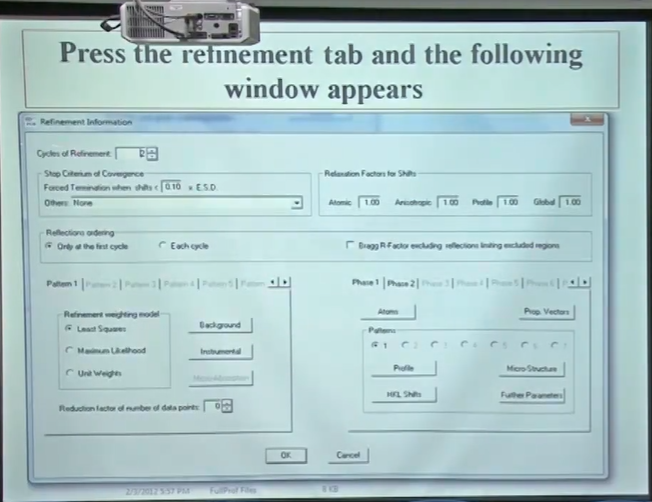

> I took the background 6 coefficient polynomial  

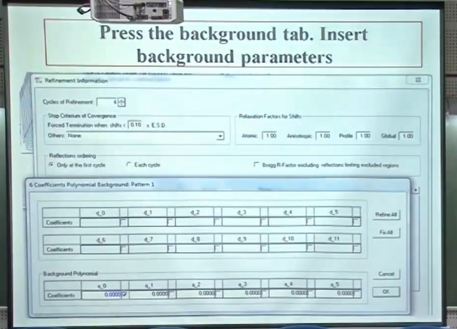

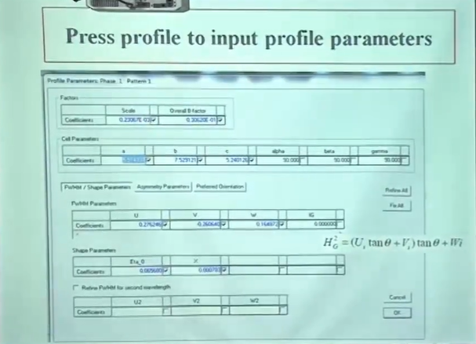

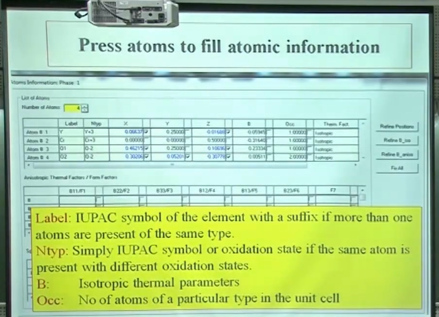

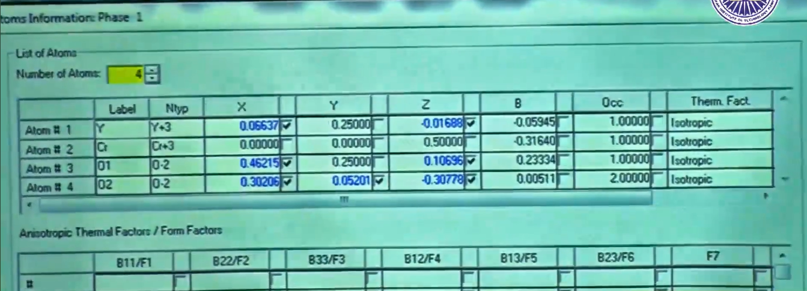

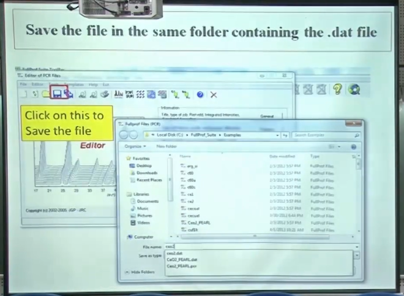

> Save in the format of .pcr  

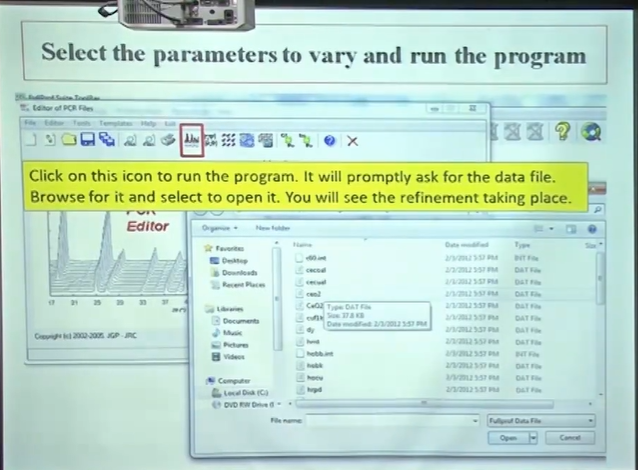

## Sequence of varying the parameters

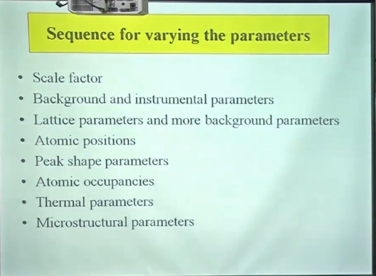

> Scale factor - This will scale the intensity  
> Atomic positions - One by one very carefully  
> Atomic occupancy - If you need. e.g. where gallium and Iron can be mixed  

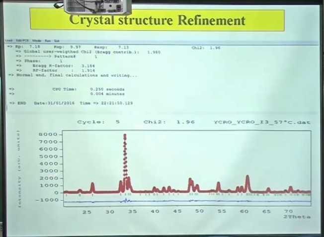

> Above is one of the image after refinement  
> Now you have all things - Lattice parameters, atomic positions in correct way. Refined values  
> of lattice parameters and atomic positions of your materials  
> Then you are ready to generate your structure  

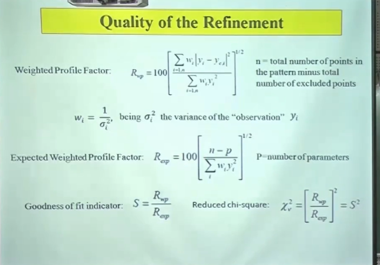

> Above are some mathematicals equations  
> More correctly, the algebraic mathematics and all equations are taken from the manual of FullProf software. Not hidden anything here  

## VESTA Software

> It's a free and very easy way to generate your structure  
> From structure you can get a lot of information like - Bond length, bond angle, distortion, index, average bond length and you can see the type of polyhedrals be here  

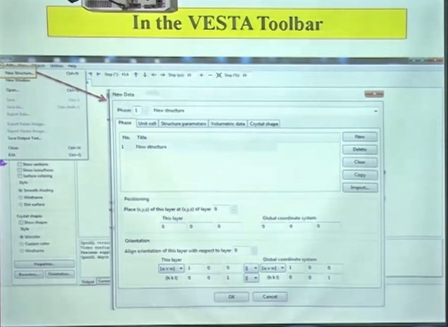

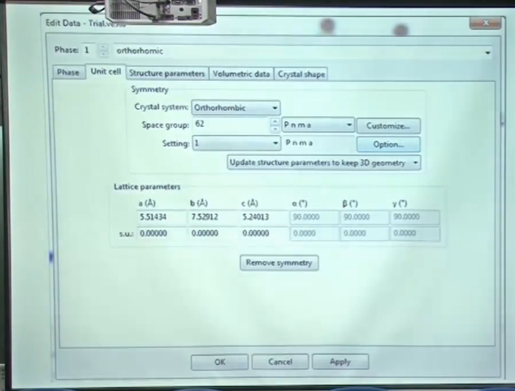

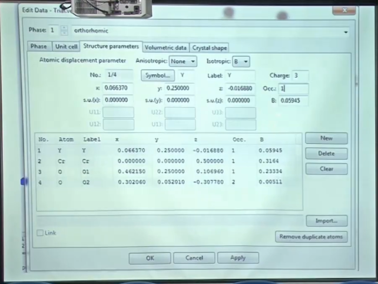

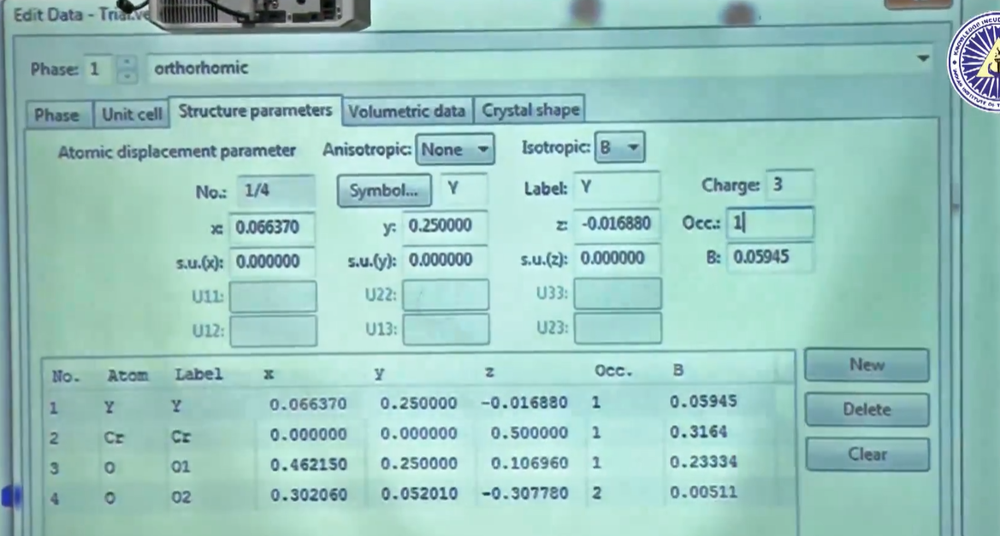