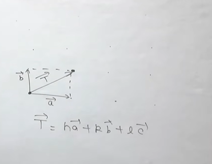
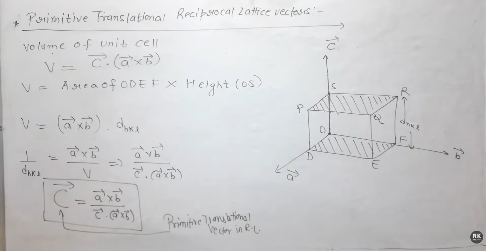
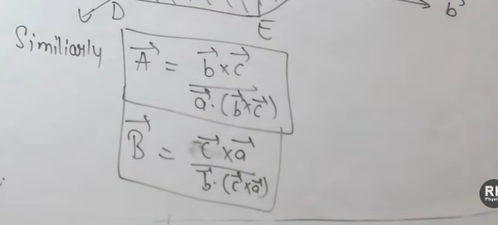
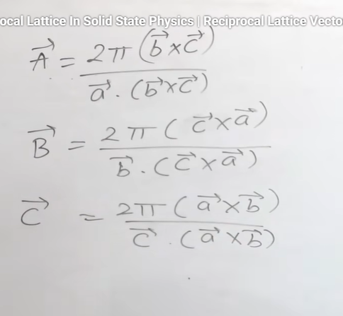
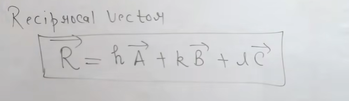
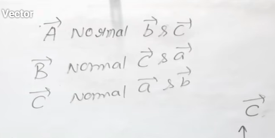
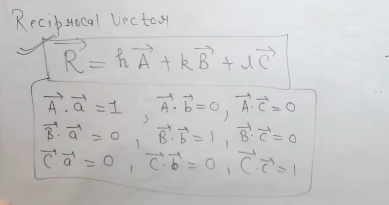

# Reciprocal Lattice In Solid State Physics | Reciprocal Lattice Vector

Link - https://www.youtube.com/watch?v=Pjd-y5Wrt1g&list=PLO1URmIbkyNtLlOR2zyEsu2Npd3nvmzXZ&index=10

> Why we are using the word "reciprocal" ?  
> Because we are taking reciprocal of dₕₖₗ 

## Primitive translational reciprocal lattice vectors  

For direct lattice we have  

  

> Reciprocal lattice में आप plane to plane चलोगे ।  

  

So we have 3 formulas  

  

So total reciprocal vector is 

A,B, C vectors are for reciprocal lattice  
a,b,c vectors are for direct lattice  

> Remember these conditions

