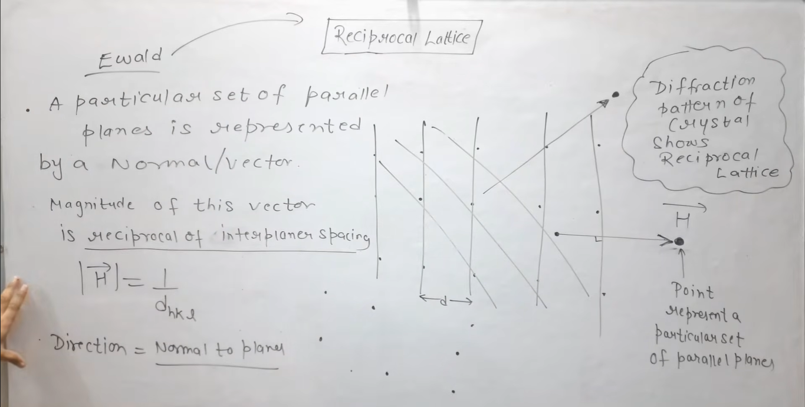

# Reciprocal Lattice In Solid State Physics | Reciprocal Lattice Vector

Link - https://www.youtube.com/watch?v=Pjd-y5Wrt1g&list=PLO1URmIbkyNtLlOR2zyEsu2Npd3nvmzXZ&index=10

> Why we are using the word "reciprocal" ?  
> Because we are taking reciprocal of dₕₖₗ 