# XRD(Data analysis)

Link - https://www.youtube.com/watch?v=ntoCCusvUGs

## Learning Objectives

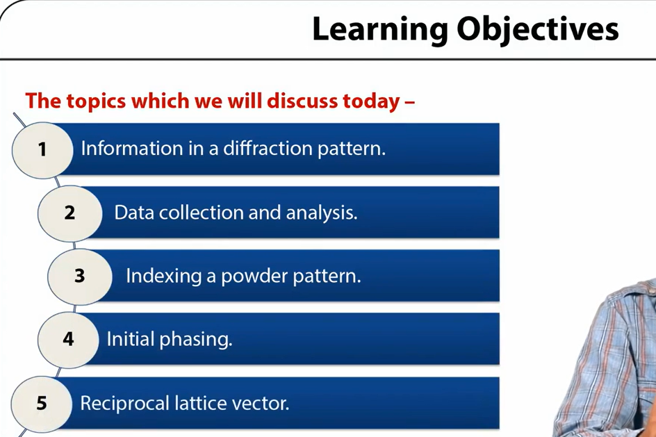

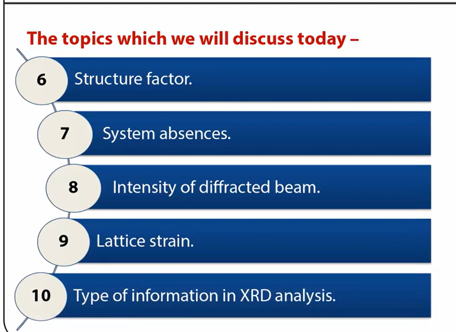

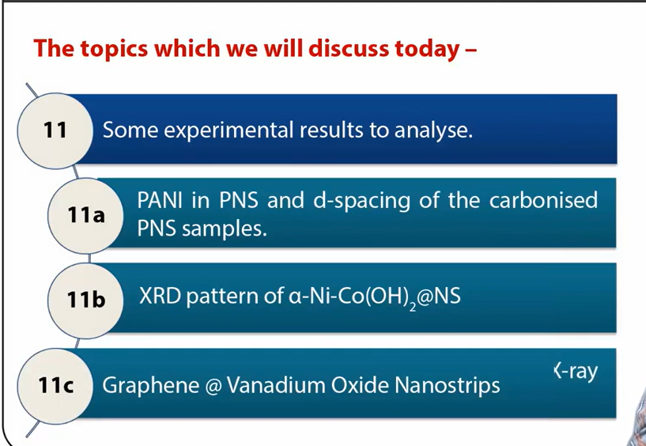

## Requirements for Sample Preparation

* All types of powder diffraction analyses are non-destructive. XRD measurements require about
1 g sample.
* Intensity aberration minimization for samples with large unit cells may require about 5 g
sample.
* Generally 5 g of sample material are preferred, although quantities as small as 0.25 g can be
analyzed.
* For routine qualitative analysis, approximately 1 g sample is sufficient.
* In case of well-crystalline, single grain, about 1 mg of material is sufficient.
* For bulk sample analysis, where certain fraction is to be extracted, we require preferably more
than 10 g sample.
* Neutron diffraction require normally larger amounts samples ~- 5-10 g. The sample should be
representative of the bulk material and should be crushed to less than 50 micron powder.

## Data Collection and Analysis

* Choose 20 range
* Step size and time per step
* Hardware: slit size, filter, sample alignment
* Fast scan followed with a slower scan
* Look for fluorescence
* **Collected data: Background subtraction, K-alpha2 stripping**
* Normalize data for comparison I/Imax

## Application of XRD Analysis

* Nano-Materials: Phase Composition, Crystallite size and shape, Lattice Distortions and
Faulting, Composition Variations, Orientation, In-Situ Structure Development
* Reservoir core analysis
* Fuel quality testing
* New materials research and development
* Polymers and composites
* Pharmaceuticals and Organics
* Polymorphs, Crystallinity, Orientation

## Nano-technology Research Involving Materials Structure Analysis Via X-ray Diffraction (XRD)

* Nano-Technology research and X-Ray Analysis is applied to the understanding of
characteristics of nano-materials and nanostructure of crystalline materials, semi-crystalline
materials and amorphous materials in industries such as glass and polymers, and requires
specialist understanding and interpretation of results.
* Analysis of peak shapes give information about crystallite size and other aspects of
microstructure, particularly lattice distortions due to composition or micro-strain variations,
and faulting.
* XRD provides an adaptable method for measuring crystalline phases, degree of crystallinity
and structures.
* Crystalline orientation is another important measurement provided by XRD
* Using mathematical technique of Fourier transforms ,the recorded series of two dimensional
diffraction pattern is converted into a three-dimensional model of electron density.
* **Indexing the reflections** - This means identifying the dimensions of the unit cell and which peak correspond to which position in reciprocal space.
* **Symmetry of crystal** i.e. space group is determine by the by product of indexing.
* **Indexing** is generally accomplished using an auto indexing routine.
* The data is then integrated after assigning the symmetry, which results in conversion of
hundreds of images containing the thousands of reflections into a single file.
* A full set of data contains hundreds of separate images taken at different orientations of the
crystal.

## Indexing a Powder Pattern

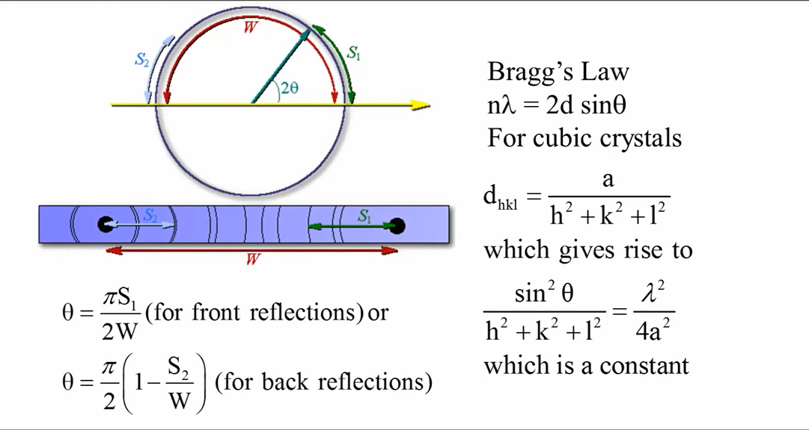

## Initial Phasing

* The data collected from a diffraction pattern is a reciprocal space representation of the crystal lattice.
* The position of the each diffraction spot is governed by the inherent symmetry within the
crystal and by the shape and size of the unit cell.
* The intensity of each spot is recorded and is proportional to the square of the structure factor
amplitude.
* The structure factor is defined as the complex number which contains information relating to
both the phase and the amplitude of the wave.
* The phase cannot be recorded directly during the experiment and this is known as the phase
problem.

## Initial Phase can be Obtained in Different Ways

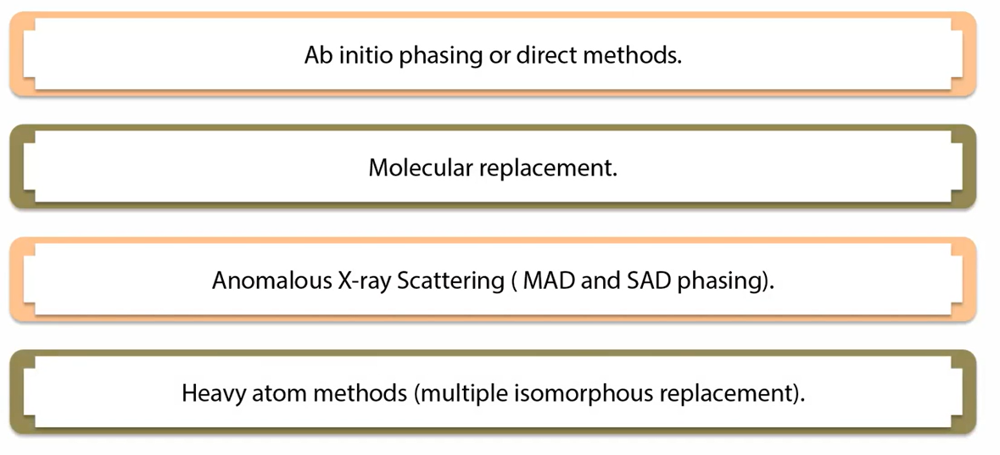

## Structure Factor

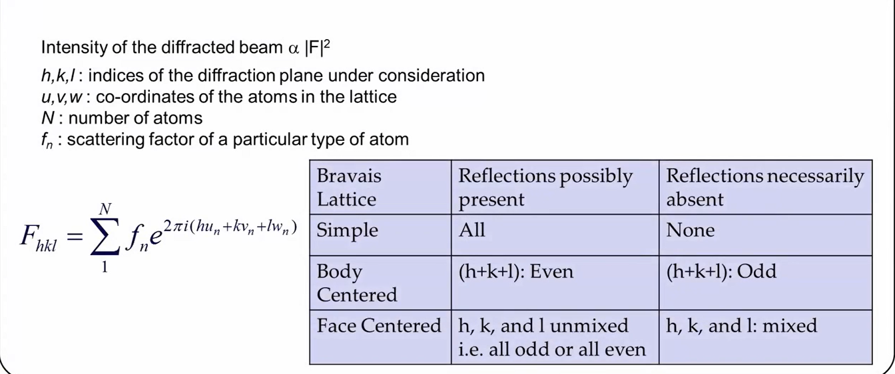

## Calculated Patterns for a Cubic Crystal

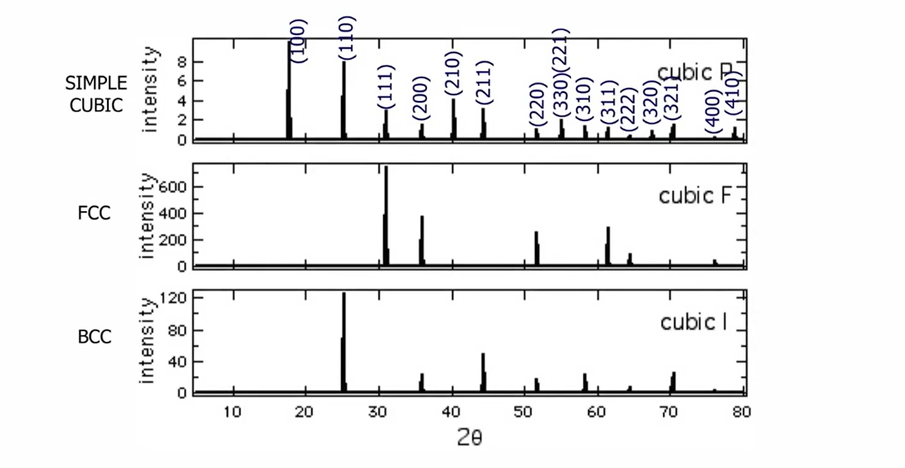

## NaCl Crystals in a Tube Facing X-ray Beam

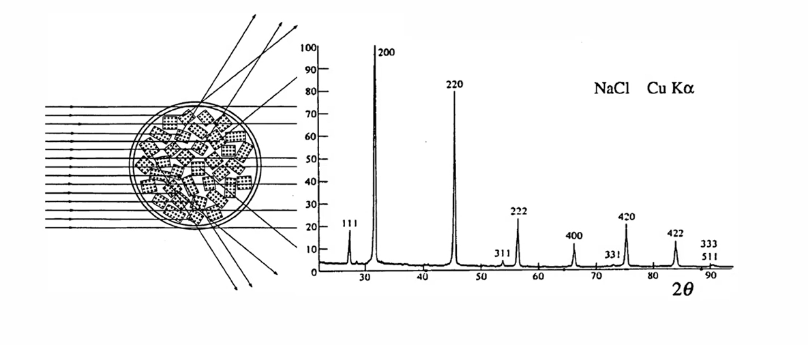

## Intensity of Diffracted Beam

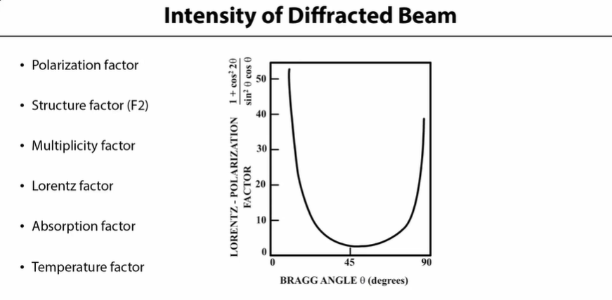

## Lattice Strain

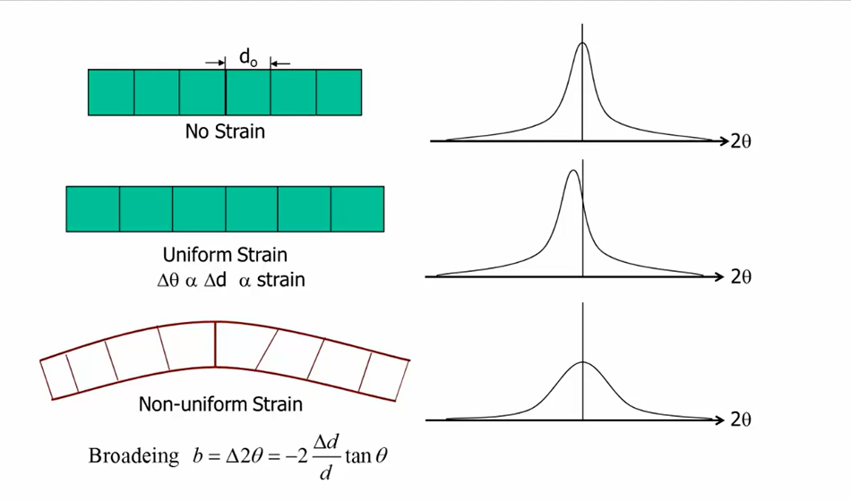

## PANI in PNS and d-spacing of the Carbonised PNS Samples

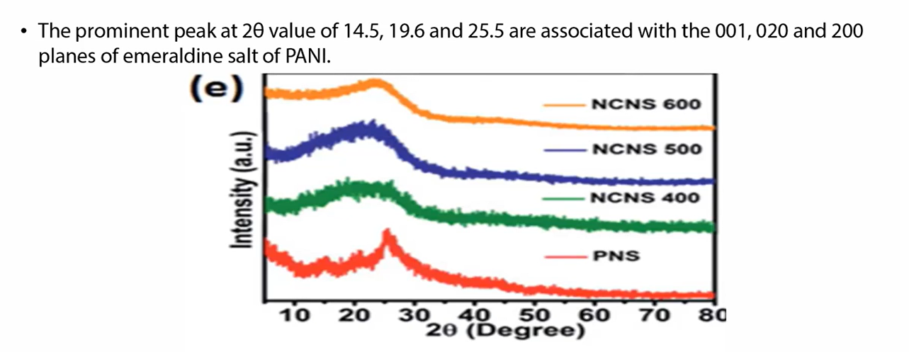

SOURCE - http://pubs.rsc.org/-/content/articlepdf/2016/ra/c6ra00068a 

Website - https://pubs.rsc.org/

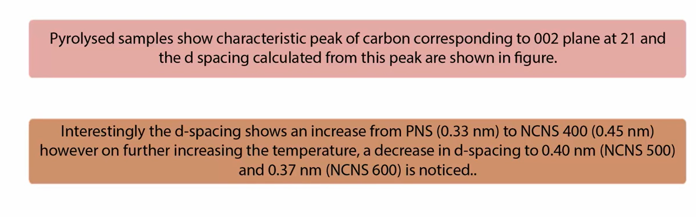

