# X-Ray Diffraction (XRD) || Characterization Techniques

Link - https://www.youtube.com/watch?v=5aMPF9TovF0

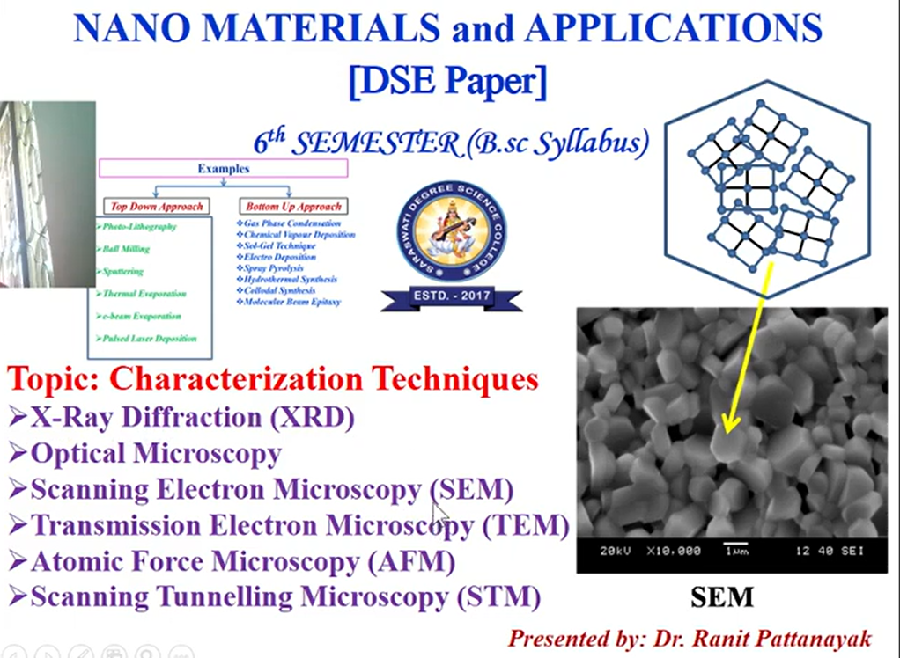

## Production of X-rays

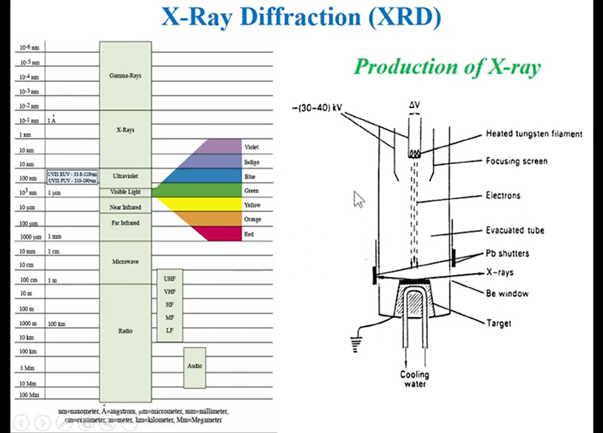

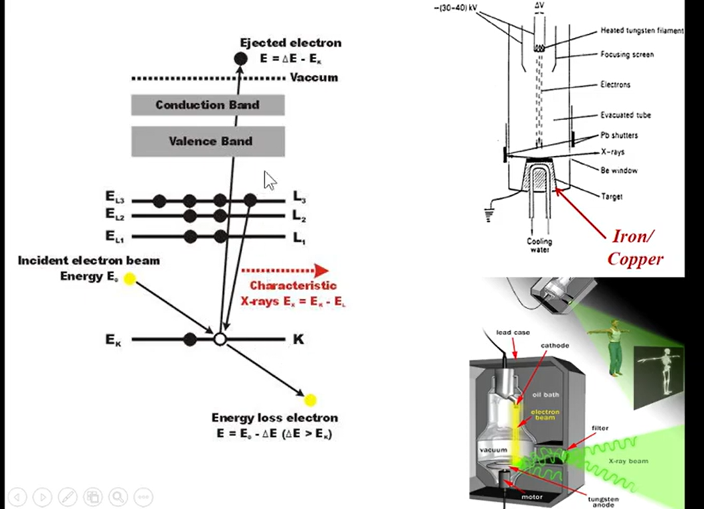

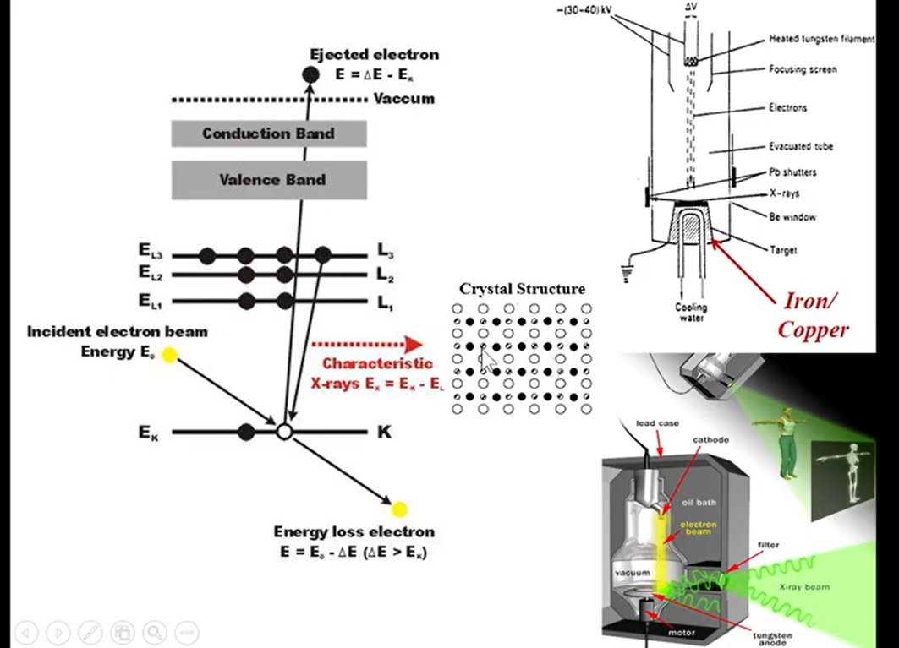

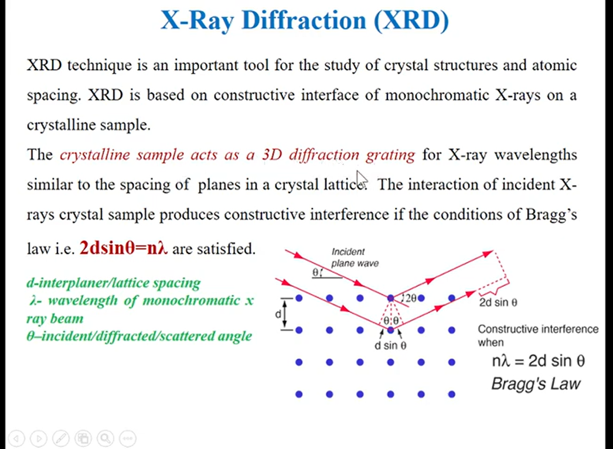

> Planes in 3-dimension and it's different orientation possible(concept of reciprocal lattice)

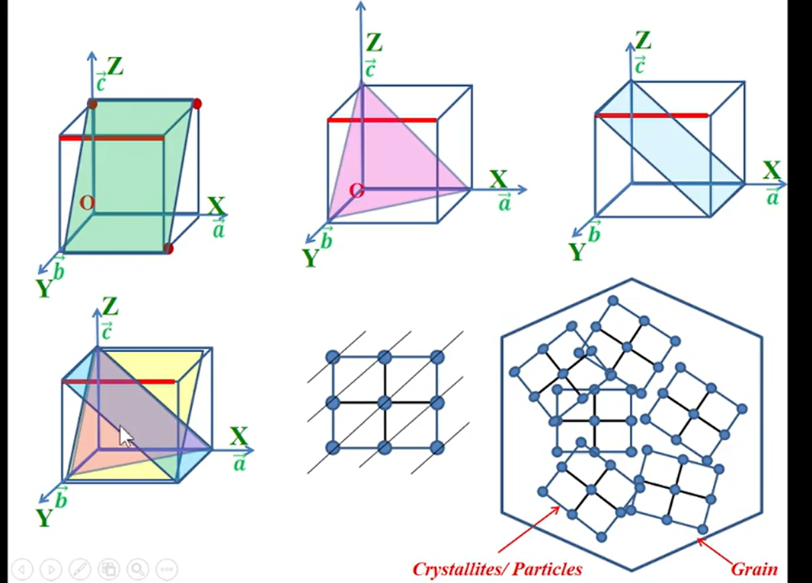  

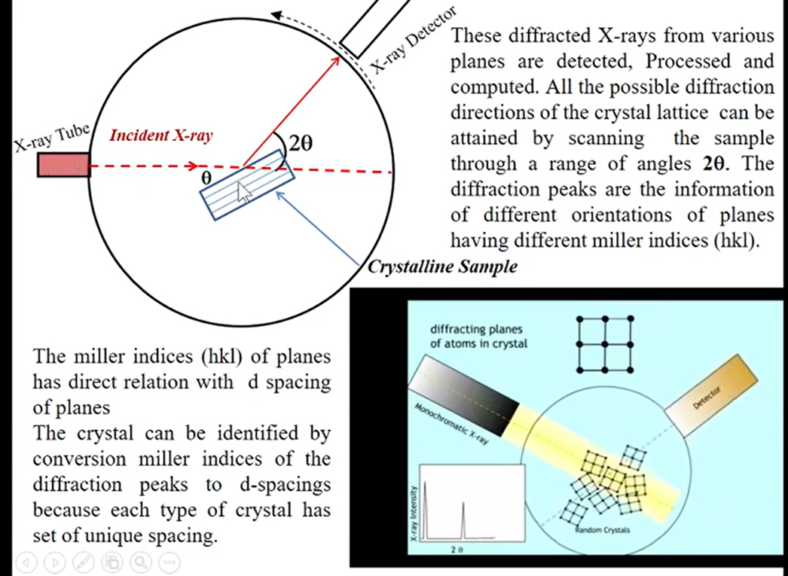

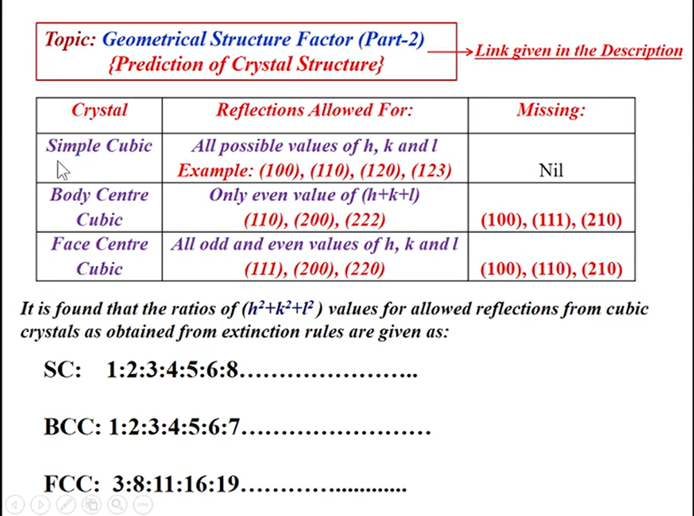

> Consider the below example 

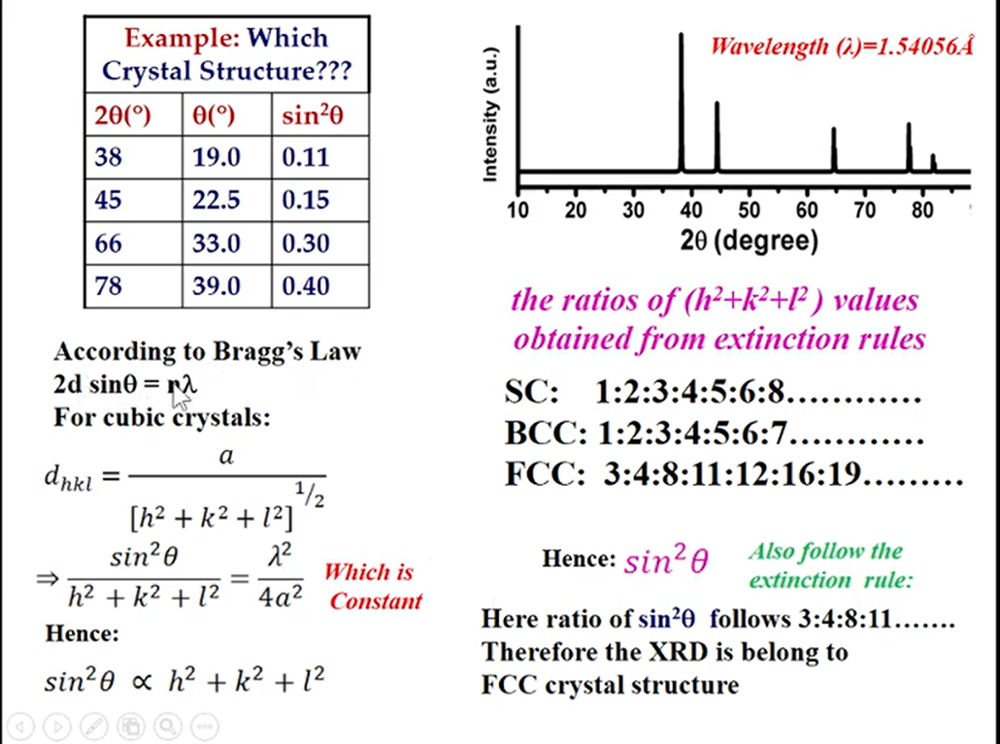

> The peaks(reflection) are basically information about planes  

* At 2θ we have peaks  

divide the values - 0.11/0.15 = 0.73

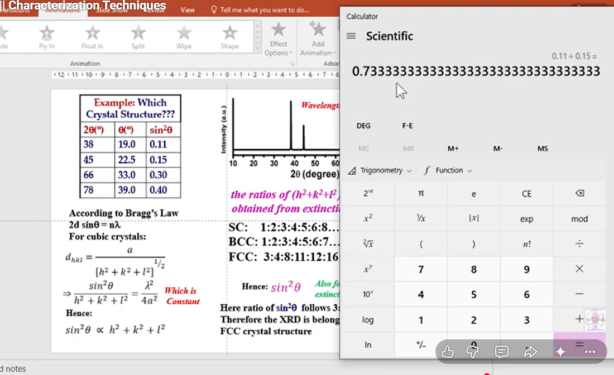

and if we check for FCC 3/4 = 0.75  

* 4/8 = 0.5  
  * for sin²θ 0.15/0.30 = 0.5

so the ratio h²+k² +l²  and sin²θ matches with FCC  

* sin²θ is proportional to h²+k²+l² 

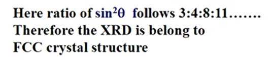

In this way we can determine the lattice structure from XRD Pattern  

## Application

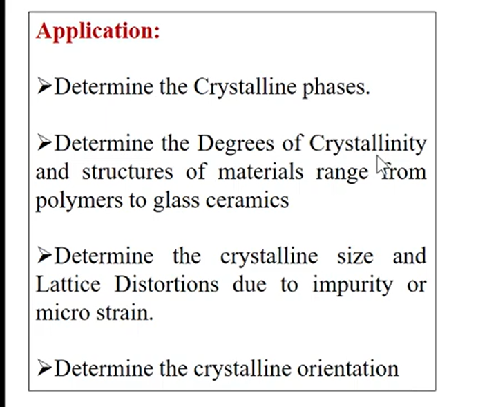