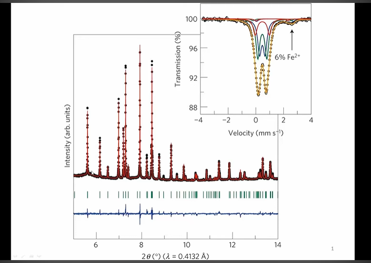
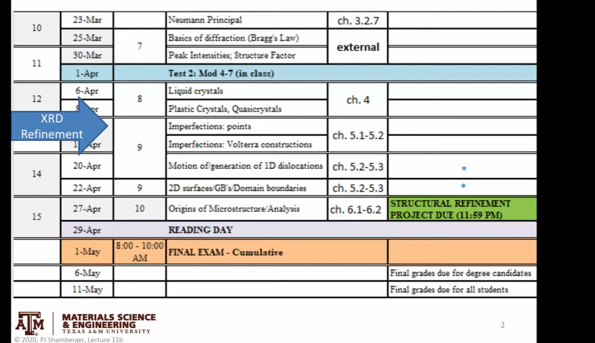
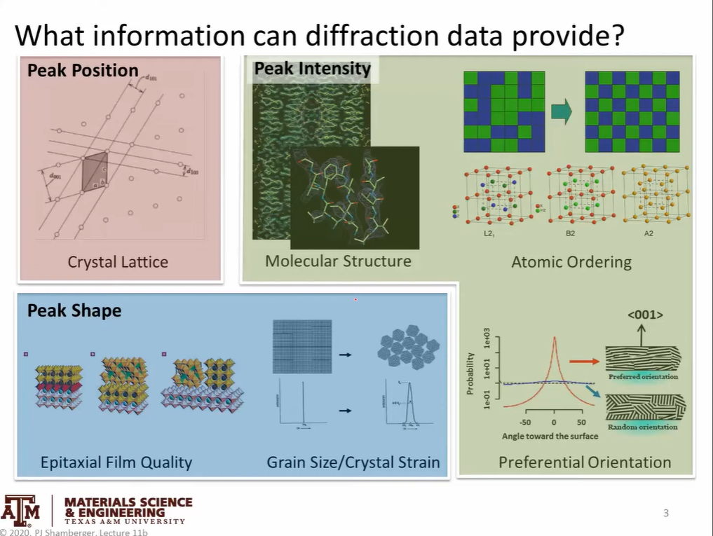
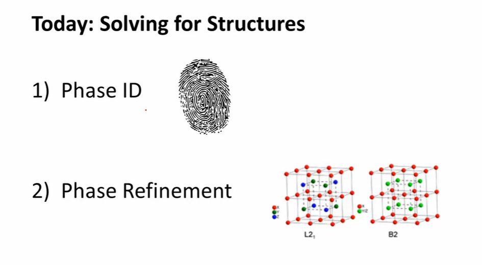
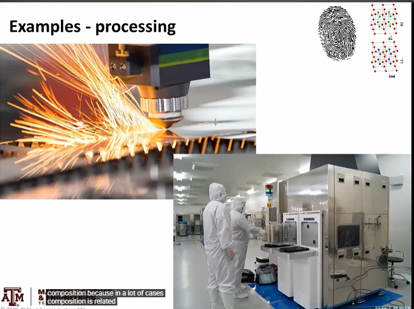
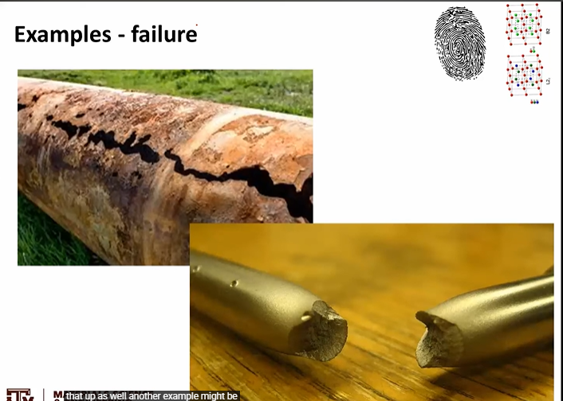
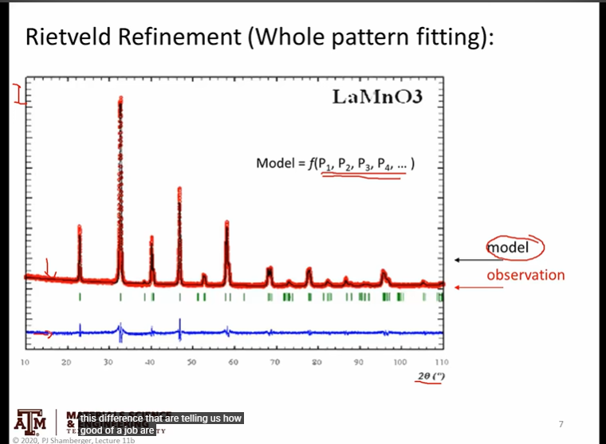
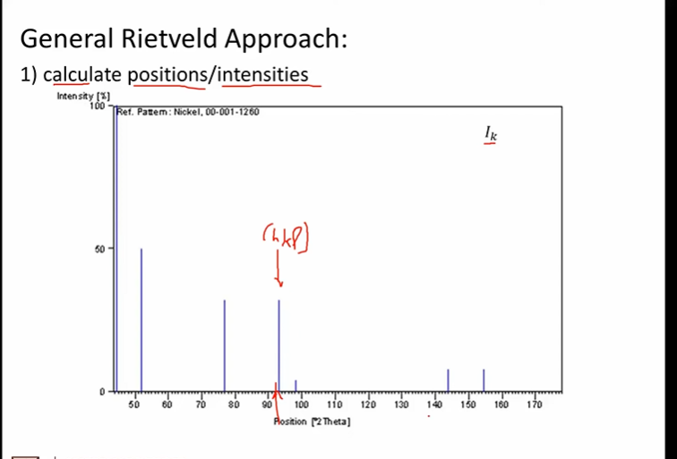

# XRD Refinement Theory

Link - https://www.youtube.com/watch?v=nK-O8VYFVxw

## Examples

## Rietveld Refinement

> I just want to say very generally the problem is that we have a number of observations so each individual intensity point, we are measuring this a function of the scattering angle and at each scan we have a particular intensity point  
> You could think about this as a very complicated function, it's a function of a whole bunch of different parameters  
> And those parameters are due to part of different diffractometers but also part of the material itself  
> And What we would like to do is generate some model functions so the black line here that fits those observations as closely as possible and  
> We we generally do is we look at the difference between these two to say how good of job of that objective  
> Like how good are we at recreating the observations with the model that we're using
> f(p1, p2, p3, p4, ...)  

## General Rietveld Approach

